# 🔐 Login System — Backend Documentation

> **Audience:** Developers, contributors, and anyone curious about how this backend works.
> This guide explains everything from the big picture to the specific API calls — no prior knowledge of this codebase required.

---

## 📖 Table of Contents
1. [What is this?](#1-what-is-this)
2. [Tech Stack](#2-tech-stack)
3. [Project Structure](#3-project-structure)
4. [Core Concepts](#4-core-concepts)
5. [Authentication Flows](#5-authentication-flows)
6. [API Reference](#6-api-reference)
7. [Database Entities](#7-database-entities)
8. [Security Architecture](#8-security-architecture)
9. [Configuration & Environment Variables](#9-configuration--environment-variables)
10. [Observability](#10-observability)
11. [Running Locally](#11-running-locally)
12. [Coding Conventions](#12-coding-conventions)
13. [Roadmap](#13-roadmap)
14. [Visual Flow Diagrams](#14-visual-flow-diagrams)

---

## 1. What is this?

This is the **backend service** for a Login System that supports:
- ✅ Email/Password registration and login
- ✅ Google OAuth 2.0 ("Sign in with Google")
- ✅ Account linking — a user who signed up via Google can later log in with email and set a password
- ✅ JWT-based stateless authentication with access + refresh token pair
- ✅ Refresh token rotation (single active session per user)
- ✅ Secure logout (refresh token revocation)
- ✅ Extended user profile — phone number and address fields

---

## 2. Tech Stack

| Layer | Technology |
|---|---|
| Language | Java 17 |
| Framework | Spring Boot 3.x |
| Build Tool | Maven |
| Database (Prod) | PostgreSQL |
| Database (Dev) | H2 (in-memory) |
| Authentication | Spring Security + JWT (JJWT) |
| OAuth 2.0 | Spring OAuth2 Client (Google) |
| Password Hashing | BCrypt |
| Monitoring | Spring Actuator + Prometheus |

---

## 3. Project Structure

```
login-system-backend/
├── src/
│   └── main/
│       ├── java/com/akash/loginsystem/
│       │   ├── controller/       # REST API endpoints
│       │   ├── service/          # Business logic interfaces
│       │   │   └── impl/         # Business logic implementations
│       │   ├── repository/       # Spring Data JPA (database access)
│       │   ├── entity/           # Database table models (User, RefreshToken)
│       │   ├── dto/
│       │   │   ├── request/      # Incoming request bodies
│       │   │   └── response/     # Outgoing response bodies
│       │   ├── security/         # JWT filter, OAuth2 handler, SecurityConfig
│       │   ├── config/           # App-wide configuration beans
│       │   ├── exception/        # Global error handling
│       │   └── model/            # Enums (AuthProvider, Role)
│       └── resources/
│           ├── application.yml      # Main config (uses env vars)
│           └── application-dev.yml  # H2 dev overrides
└── pom.xml
```

---

## 4. Core Concepts

### 4.1 Two-Token Authentication

The server issues **two tokens** on every successful login:

| Token | Type | Lifetime | Stored Where |
|---|---|---|---|
| **Access Token** | JWT (signed) | Short (e.g. 1 hour) | Client memory / local storage |
| **Refresh Token** | Opaque UUID | Long (e.g. 30 days) | Server database + client |

- The **access token** is sent with every API request as a `Bearer` header.
- When it expires, the client uses the **refresh token** to silently get a new pair — without asking the user to log in again.
- The server **only stores the refresh token** — no session state is kept for access tokens.

### 4.2 Single Active Session

The system enforces **one active session per user**. Every time a new login succeeds, the server deletes any previously issued refresh token before creating the new one. This means logging in from a second device automatically invalidates the first device's session.

### 4.3 AuthProvider Enum

Every user has an `AuthProvider` that tells us how they originally registered:

| Value | Meaning |
|---|---|
| `LOCAL` | Registered with email + password |
| `GOOGLE` | Registered via Google OAuth |

### 4.4 Account Linking

A single `User` row covers both login methods. If a user signs up via Google first and later wants an email+password login, the system detects their account exists but no password was set. It requires them to re-authenticate via Google to prove identity, then allows them to set a password — no duplicate accounts created.

### 4.5 Secure OAuth Redirect (No Token in URL)

After a Google login, tokens are **never placed in the redirect URL** (which would expose them in browser history and server logs). Instead:
1. The backend stores the tokens in an in-memory `OAuthTokenStore` keyed by a short-lived opaque code (30-second TTL).
2. The redirect URL carries only that opaque code: `/oauth/callback?code=<opaque>`.
3. The frontend exchanges the code for the real tokens via `POST /auth/oauth2/token`.

---

## 5. Authentication Flows

### 5.1 Email/Password Registration

```
Client                          Backend                         Database
  |                                |                               |
  |-- POST /auth/register -------->|                               |
  |   { name, email, password,     |                               |
  |     phoneCountryCode?,         |                               |
  |     phoneNumber?,              |-- Does email exist? --------->|
  |     addressLine1?, city?,      |<-- No ----------------------- |
  |     state?, zipCode?,          |                               |
  |     country? }                 |-- BCrypt hash password        |
  |                                |-- Save User                   |
  |                                |   (provider=LOCAL,            |
  |                                |    passwordSet=true,          |
  |                                |    optional fields stored) -->|
  |                                |<-- Saved ✅ ----------------- |
  |                                |-- Issue access + refresh token|
  |<-- 201 Created ---------------- |                              |
  |   { accessToken, refreshToken, |                               |
  |     user: { id, name, email,   |                               |
  |             provider, ... } }  |                               |
```

> Fields marked `?` are optional. If omitted, they are stored as `null`.

---

### 5.2 Email/Password Login

```
Client                          Backend                         Database
  |                                |                               |
  |-- POST /auth/login ----------->|                               |
  |   { email, password }          |-- Find user by email -------->|
  |                                |                               |
  |                                |  [User not found]             |
  |<-- 401 Unauthorized -----------|                               |
  |                                |                               |
  |                                |  [User found, passwordSet=false — OAuth-only account]
  |<-- 200 OK --------------------|                               |
  |   { requiresPasswordSet: true, |                               |
  |     user: { ... } }            |                               |
  |   ⚠️  No tokens issued         |                               |
  |                                |                               |
  |                                |  [User found, passwordSet=true]
  |                                |-- Verify BCrypt hash          |
  |                                |                               |
  |                                |  [Password wrong]             |
  |<-- 401 Unauthorized -----------|                               |
  |                                |                               |
  |                                |  [Password correct]           |
  |                                |-- Delete old refresh tokens ->|
  |                                |-- Issue access + refresh token|
  |<-- 200 OK --------------------|                               |
  |   { accessToken, refreshToken, |                               |
  |     requiresPasswordSet: false,|                               |
  |     user: { ... } }            |                               |
```

---

### 5.3 Google OAuth 2.0 Login

```
Client              Google              Backend                  Database
  |                   |                   |                         |
  |-- Click "Sign in with Google" ------->|                         |
  |<-- Redirect to Google consent page --|                         |
  |                   |                   |                         |
  |-- User grants permission ------------>|                         |
  |<-- Redirect to /oauth2/callback ------|                         |
  |                                       |                         |
  |                       Backend-to-Google (server side):         |
  |                                       |-- Exchange code ------->|
  |                                       |<-- { email, name, sub } |
  |                                       |                         |
  |                                       |-- Find user by email -->|
  |                                       |                         |
  |                                       |  [New user]             |
  |                                       |-- Create User ---------->|
  |                                       |   (provider=GOOGLE,      |
  |                                       |    passwordSet=false)    |
  |                                       |                         |
  |                                       |  [Existing user]        |
  |                                       |-- Link Google sub ------>|
  |                                       |   (update providerId)   |
  |                                       |                         |
  |                                       |-- Issue access + refresh|
  |                                       |-- Store in OAuthTokenStore (30s TTL)
  |                                       |-- Opaque code generated |
  |<-- Redirect to /oauth/callback?code=<opaque> ------------------|
  |                                       |                         |
  |-- POST /auth/oauth2/token ----------->|                         |
  |   { "code": "<opaque>" }              |-- Consume code from store
  |<-- 200 OK ----------------------------|                         |
  |   { accessToken, refreshToken,        |                         |
  |     requiresPasswordSet: true/false,  |                         |
  |     user: { ... } }                   |                         |
  |                                       |                         |
  |  [If requiresPasswordSet=false]       |                         |
  |  → Redirect to /homepage ✅           |                         |
  |                                       |                         |
  |  [If requiresPasswordSet=true]        |                         |
  |  → Redirect to /set-password ⚠️       |                         |
```

---

### 5.4 Account Linking Flow (OAuth user sets a password)

> This is the key flow that prevents duplicate accounts. It has **three phases**.

**Phase 1 — Detect that a password has never been set:**
```
Client                          Backend
  |                                |
  |-- POST /auth/login ----------->|
  |   { email, password }          |-- User found, passwordSet=false
  |<-- 200 OK --------------------|
  |   { requiresPasswordSet: true, |
  |     user: { email, ... } }     |
  |   ⚠️  No tokens issued         |
  |                                |
  |  [Frontend routes to Set Password page, shows "Sign in with Google" button]
```

**Phase 2 — Prove identity via Google (to obtain a token):**
```
Client                          Google          Backend
  |                                |               |
  |-- Click "Sign in with Google" ------------->  |
  |          (same Google OAuth flow as 5.3)      |
  |<-- Tokens returned (requiresPasswordSet=true) |
  |                                               |
  |  [Frontend sees requiresPasswordSet=true → stays on /set-password]
  |  [accessToken is now held by the client]
```

**Phase 3 — Set the password using the token from Phase 2:**
```
Client                          Backend                         Database
  |                                |                               |
  |-- POST /auth/set-password ---->|                               |
  |   Authorization: Bearer <token>|-- Verify token, extract userId|
  |   { password,                  |-- Load user, check passwordSet=false
  |     confirmPassword }          |-- Confirm passwords match     |
  |                                |-- BCrypt hash new password    |
  |                                |-- Save (passwordSet=true) ---->|
  |                                |-- Issue new access + refresh  |
  |<-- 200 OK --------------------|                               |
  |   { accessToken, refreshToken, |                               |
  |     requiresPasswordSet: false,|                               |
  |     user: { ... } }            |                               |
  |  ✅ Redirect to /homepage      |                               |
```

> **Why Google re-auth is required:** `/set-password` is a protected endpoint — it requires a valid Bearer token. Since the email-only login path deliberately issues no tokens when `passwordSet=false`, the user must prove their identity via Google OAuth first.

---

### 5.5 Token Refresh

```
Client                          Backend                         Database
  |                                |                               |
  |  [Access token expired]        |                               |
  |-- POST /auth/refresh ---------->|                              |
  |   { refreshToken: "<uuid>" }   |-- Find token in DB ---------->|
  |                                |<-- Found -------------------- |
  |                                |-- Check expiry               |
  |                                |                               |
  |                                |  [Expired]                    |
  |                                |-- Delete expired token ------>|
  |<-- 401 Unauthorized -----------|                               |
  |  [Client must log in again]    |                               |
  |                                |                               |
  |                                |  [Valid — atomic delete]      |
  |                                |-- DELETE token (1 row) ------->|
  |                                |  [If 0 rows: replay detected — reject]
  |                                |-- Issue new access + refresh ->|
  |<-- 200 OK --------------------|                               |
  |   { accessToken, refreshToken, |                               |
  |     user: { ... } }            |                               |
  |  ✅ Old refresh token is dead  |                               |
```

> Token rotation is **atomic** — the old token is deleted and the new one is issued in the same transaction. If two requests arrive simultaneously with the same refresh token, only the first succeeds. The second gets a 401.

---

### 5.6 Logout

```
Client                          Backend                         Database
  |                                |                               |
  |-- POST /auth/logout ----------->|                              |
  |   Authorization: Bearer <token>|-- Verify token, extract userId|
  |                                |-- Delete ALL refresh tokens -->|
  |                                |   for this user               |
  |<-- 204 No Content -------------|                               |
  |  ✅ Refresh token invalidated  |                               |
```

> The **access token is not invalidated** — it remains valid until its natural expiry (max 1 hour). For immediate revocation, access token blacklisting would be required (planned for a future phase).

---

## 6. API Reference

**Base URL:** `http://localhost:8080/api/v1`

All endpoints return JSON. Protected endpoints (🔒) require:
```
Authorization: Bearer <access-token>
```

---

### `POST /auth/register`
Register a new user with email and password. All profile fields except `name`, `email`, and `password` are optional.

**Request Body:**
```json
{
  "name": "Akash Beura",
  "email": "akash@example.com",
  "password": "StrongPass123!XY",
  "phoneCountryCode": "+91",
  "phoneNumber": "9876543210",
  "addressLine1": "Flat 4B, Andheri West",
  "city": "Mumbai",
  "state": "Maharashtra",
  "zipCode": "400053",
  "country": "India"
}
```

**Response (201 Created):**
```json
{
  "accessToken": "eyJhbGciOiJIUzI1NiJ9...",
  "refreshToken": "f47ac10b-58cc-4372-a567-0e02b2c3d479",
  "requiresPasswordSet": false,
  "user": {
    "id": "550e8400-e29b-41d4-a716-446655440000",
    "name": "Akash Beura",
    "email": "akash@example.com",
    "provider": "LOCAL",
    "passwordSet": true,
    "phoneCountryCode": "+91",
    "phoneNumber": "9876543210",
    "addressLine1": "Flat 4B, Andheri West",
    "city": "Mumbai",
    "state": "Maharashtra",
    "zipCode": "400053",
    "country": "India"
  }
}
```

**Error (409 Conflict):** Email already registered.

---

### `POST /auth/login`
Log in with email and password.

**Request Body:**
```json
{
  "email": "akash@example.com",
  "password": "StrongPass123!XY"
}
```

**Response (200 OK) — Successful login:**
```json
{
  "accessToken": "eyJhbGciOiJIUzI1NiJ9...",
  "refreshToken": "f47ac10b-58cc-4372-a567-0e02b2c3d479",
  "requiresPasswordSet": false,
  "user": { "id": "...", "name": "Akash Beura", "email": "akash@example.com", "provider": "LOCAL", ... }
}
```

**Response (200 OK) — OAuth user, no password set yet:**
```json
{
  "requiresPasswordSet": true,
  "user": { "id": "...", "name": "Akash Beura", "email": "akash@example.com", "provider": "GOOGLE", ... }
}
```
> ⚠️ **No tokens are issued** in this case. The client must re-authenticate via Google OAuth (see flow 5.4).

**Error (401 Unauthorized):** Email not found or wrong password.

---

### `POST /auth/set-password` 🔒
Set a password for an OAuth user completing account linking. **Requires a valid Bearer token** obtained via Google OAuth. Blocked with `409` if a password is already set.

**Request Body:**
```json
{
  "password": "NewStrongPass456!AB",
  "confirmPassword": "NewStrongPass456!AB"
}
```

**Response (200 OK):**
```json
{
  "accessToken": "eyJhbGciOiJIUzI1NiJ9...",
  "refreshToken": "a1b2c3d4-...",
  "requiresPasswordSet": false,
  "user": { "id": "...", "passwordSet": true, ... }
}
```

**Error (409 Conflict):** Password already set — use a "change password" flow instead.
**Error (400 Bad Request):** `password` and `confirmPassword` do not match.

---

### `POST /auth/refresh`
Exchange a valid refresh token for a new access + refresh token pair. The old refresh token is **atomically invalidated** (token rotation).

**Request Body:**
```json
{
  "refreshToken": "f47ac10b-58cc-4372-a567-0e02b2c3d479"
}
```

**Response (200 OK):**
```json
{
  "accessToken": "eyJhbGciOiJIUzI1NiJ9...",
  "refreshToken": "new-uuid-here",
  "requiresPasswordSet": false,
  "user": { ... }
}
```

**Error (401 Unauthorized):** Refresh token not found, expired, or already consumed.

---

### `POST /auth/oauth2/token`
Exchange the short-lived opaque code (from the Google OAuth redirect) for the actual `AuthResponse`. The code is **single-use** and expires in **30 seconds**.

**Request Body:**
```json
{
  "code": "3f7a9b2e-1c4d-4e8f-a0b1-2c3d4e5f6789"
}
```

**Response (200 OK):**
```json
{
  "accessToken": "eyJhbGciOiJIUzI1NiJ9...",
  "refreshToken": "new-uuid-here",
  "requiresPasswordSet": false,
  "user": { "id": "...", "name": "Akash Beura", "provider": "GOOGLE", ... }
}
```

**Error (400 Bad Request):** Code is invalid or expired.

---

### `POST /auth/logout` 🔒
Revoke all refresh tokens for the currently authenticated user.

**Response (204 No Content):** No body.

> The access token remains valid until its natural expiry. Callers should discard it on the client side.

---

### `GET /users/me` 🔒
Get the currently authenticated user's full profile.

**Response (200 OK):**
```json
{
  "id": "550e8400-e29b-41d4-a716-446655440000",
  "name": "Akash Beura",
  "email": "akash@example.com",
  "provider": "LOCAL",
  "passwordSet": true,
  "phoneCountryCode": "+91",
  "phoneNumber": "9876543210",
  "addressLine1": "Flat 4B, Andheri West",
  "city": "Mumbai",
  "state": "Maharashtra",
  "zipCode": "400053",
  "country": "India"
}
```

---

## 7. Database Entities

### `User` Table (`users`)

| Column | Type | Nullable | Description |
|---|---|---|---|
| `id` | UUID | No | Primary key, auto-generated |
| `name` | VARCHAR | No | Full name |
| `email` | VARCHAR (UNIQUE) | No | Login identifier, always lowercase |
| `password` | VARCHAR | Yes | BCrypt hash. **Null for OAuth users** until they set a password |
| `provider` | ENUM | No | `LOCAL` or `GOOGLE` — how the account was first created |
| `provider_id` | VARCHAR | Yes | Google's `sub` (subject ID). Null for LOCAL users |
| `password_set` | BOOLEAN | No | `false` for new OAuth users until they complete account linking |
| `role` | ENUM | No | `USER` (default) — used in JWT claims for authorization |
| `phone_country_code` | VARCHAR | Yes | e.g. `+91`. Optional at registration |
| `phone_number` | VARCHAR | Yes | Up to 10 digits. Optional at registration |
| `address_line1` | VARCHAR | Yes | Street address. Optional at registration |
| `city` | VARCHAR | Yes | Optional at registration |
| `state` | VARCHAR | Yes | Optional at registration |
| `zip_code` | VARCHAR | Yes | Postal/PIN code. Optional at registration |
| `country` | VARCHAR | Yes | Country name. Optional at registration |
| `created_at` | TIMESTAMP | No | Account creation time, immutable |
| `updated_at` | TIMESTAMP | No | Last modification time, auto-updated |

### `RefreshToken` Table (`refresh_tokens`)

| Column | Type | Nullable | Description |
|---|---|---|---|
| `id` | UUID | No | Primary key |
| `user_id` | UUID (FK → `users.id`) | No | The user this token belongs to |
| `token` | VARCHAR | No | The opaque refresh token value (UUID string) |
| `expires_at` | TIMESTAMP | No | When this token expires |

> **One token per user:** `issueTokens()` calls `deleteByUser()` before saving the new token, so at most one refresh token row exists per user at any time.

---

## 8. Security Architecture

### How JWT Works Here

1. User logs in → `AuthService` verifies credentials.
2. `JwtProvider` generates a **short-lived access token** (JWT) containing:
   - `sub` — the user's UUID (used to load the user on each request)
   - `role` — `USER` (used for authorization)
   - `iss` — the service's base URL (identifies the issuer)
   - `jti` — a unique token ID (prevents token confusion attacks)
3. Token is signed with a secret key (`JWT_SECRET` env var) using HS256.
4. A **long-lived refresh token** (opaque UUID) is stored in the database.
5. Client stores both tokens and sends the access token in the `Authorization: Bearer` header on every request.
6. `JwtAuthFilter` intercepts every request, validates the access token's signature and expiry, and populates the `SecurityContext`.
7. When the access token expires, the client silently calls `POST /auth/refresh` to get a fresh pair.

> **Note:** Email is intentionally **not** included in the JWT claims. The filter loads the user by `sub` (userId) from the database, so the token never becomes stale if the email changes.

### Request Lifecycle

```
Incoming Request
    ↓
JwtAuthFilter
  → Extracts "Bearer <token>" from Authorization header
  → Validates signature + expiry via JwtProvider
  → Loads UserDetails from DB via CustomUserDetailsService
  → Sets SecurityContext with user identity
    ↓
Spring Security
  → Checks if endpoint requires authentication
  → Checks role-based access if applicable
    ↓
Controller → Service → Repository → Database
    ↓
Response
```

### Permitted Endpoints (No token required)

- `POST /api/v1/auth/register`
- `POST /api/v1/auth/login`
- `POST /api/v1/auth/refresh`
- `POST /api/v1/auth/oauth2/token`
- `GET /oauth2/**` (Spring-managed Google OAuth callback)
- `GET /actuator/health`

### Protected Endpoints (Token required)

- `POST /api/v1/auth/set-password` — requires a valid access token (issued via Google OAuth)
- `POST /api/v1/auth/logout`
- `GET /api/v1/users/me`

---

## 9. Configuration & Environment Variables

All sensitive configuration is **externalized** via environment variables. Never hardcode secrets.

| Variable | Description | Example |
|---|---|---|
| `DB_URL` | Full JDBC URL to PostgreSQL | `jdbc:postgresql://localhost:5432/logindb` |
| `DB_USERNAME` | Database username | `postgres` |
| `DB_PASSWORD` | Database password | `secretpassword` |
| `JWT_SECRET` | Base64-encoded secret for signing JWTs (min 256-bit / 32 bytes) | `base64encodedSecretKey...` |
| `JWT_EXPIRY_MS` | Access token expiry in milliseconds | `3600000` (1 hour) |
| `JWT_REFRESH_EXPIRY_MS` | Refresh token expiry in milliseconds | `2592000000` (30 days) |
| `GOOGLE_CLIENT_ID` | From Google Cloud Console | `xxxx.apps.googleusercontent.com` |
| `GOOGLE_CLIENT_SECRET` | From Google Cloud Console | `GOCSPX-xxxxx` |
| `FRONTEND_URL` | URL of the React app (for CORS & OAuth redirect) | `http://localhost:3000` |
| `BASE_URL` | URL of this backend service (used as JWT `iss` claim) | `http://localhost:8080` |

---

## 10. Observability

The backend exposes several monitoring endpoints out of the box:

| Endpoint | What it shows |
|---|---|
| `/actuator/health` | Is the app alive? Checks DB connection |
| `/actuator/info` | App version and build info |
| `/actuator/prometheus` | Metrics scraped by Prometheus |

**Logging conventions:**
- Failed login attempts are logged as `WARN`.
- Successful logins, registrations, and logouts are logged as `INFO`.
- Refresh token replay attempts are logged as `WARN`.
- Passwords are **never** logged.

---

## 11. Running Locally

### Option A: With Docker (Recommended)
```bash
# From the project root
docker compose up --build
```
The backend will be available at `http://localhost:8080`.

### Option B: Without Docker
**Prerequisites:** Java 17+, Maven, a running PostgreSQL instance.

1. Set your environment variables (see Section 9 above) or create an `.env` file.
2. Navigate into the backend directory:
   ```bash
   cd login-system-backend
   ```
3. Run the app:
   ```bash
   mvn spring-boot:run
   ```
4. For the dev profile (uses H2 in-memory DB, no PostgreSQL needed):
   ```bash
   mvn spring-boot:run -Dspring-boot.run.profiles=dev
   ```

### Verifying it's running
```bash
curl http://localhost:8080/actuator/health
# Expected: {"status":"UP"}
```

---

## 12. Coding Conventions

| What | Convention |
|---|---|
| Controllers | `AuthController`, `UserController` |
| Services | `AuthService` interface with `AuthServiceImpl` |
| Repositories | `UserRepository`, `RefreshTokenRepository` |
| Request DTOs | `LoginRequest`, `RegisterRequest`, `SetPasswordRequest`, `RefreshRequest` |
| Response DTOs | `AuthResponse`, `UserResponse` |
| API paths | Always prefixed with `/api/v1` |
| Email handling | Always normalized to lowercase before DB interaction |
| Breaking changes | Never modify v1; create a new `/api/v2` endpoint |

---

## 13. Roadmap

| Phase | Feature | Status |
|---|---|---|
| Phase 1 | Email/Password Auth, Google OAuth, JWT, Docker | ✅ Done |
| Phase 2 | Refresh Token rotation, Logout endpoint | ✅ Done |
| Phase 3 | Rate limiting (brute force protection) | 🔜 Planned |
| Phase 4 | Migrate to Kubernetes (K8s) on GCP with Argo CD | 🔜 Planned |

---

## 14. Visual Flow Diagrams

> These diagrams mirror the flows in Section 5 but in a visual sequence format for easier reading.

---

### 14.1 Email/Password Registration Flow


---

### 14.2 Email/Password Login Flow

```mermaid
sequenceDiagram
    actor User
    participant Frontend
    participant Backend
    participant Database

    User->>Frontend: Enter Email + Password
    Frontend->>Backend: POST /api/v1/auth/login

    Backend->>Database: Find User by email
    Database-->>Backend: Result

    alt User not found
        Backend-->>Frontend: 401 Unauthorized
        Frontend-->>User: Show "Invalid credentials" ❌
    else User found — passwordSet = false (OAuth-only account)
        Backend-->>Frontend: 200 OK { requiresPasswordSet: true, user: {...} }
        Note over Frontend: No tokens issued
        Frontend-->>User: Redirect to Set Password page ⚠️
    else User found — passwordSet = true
        Backend->>Backend: Verify BCrypt hash
        alt Password wrong
            Backend-->>Frontend: 401 Unauthorized
            Frontend-->>User: Show "Invalid credentials" ❌
        else Password correct
            Backend->>Database: Delete old refresh tokens
            Backend->>Backend: Generate access + refresh tokens
            Backend->>Database: Save new RefreshToken
            Backend-->>Frontend: 200 OK { accessToken, refreshToken, user: {...} }
            Frontend-->>User: Redirect to Home Page ✅
        end
    end
```



---

### 14.3 Google OAuth 2.0 Login Flow

```mermaid
sequenceDiagram
    actor User
    participant Frontend
    participant Google
    participant Backend
    participant OAuthTokenStore
    participant Database

    User->>Frontend: Click "Sign in with Google"
    Frontend->>Google: Redirect to Google consent page
    Google-->>User: Show Google login & consent screen
    User->>Google: Grant permission

    Google-->>Backend: Redirect to /oauth2/callback?code=<auth-code>
    Backend->>Google: Exchange auth-code for user profile (server-to-server)
    Google-->>Backend: { email, name, sub (Google ID) }

    Backend->>Backend: Normalize email to lowercase
    Backend->>Database: Does this email exist?

    alt New user
        Database-->>Backend: No
        Backend->>Database: Create User (provider=GOOGLE, passwordSet=false, password=null)
    else Existing user (LOCAL or previous OAuth)
        Database-->>Backend: Yes
        Backend->>Database: Update providerId if not already set (account linking)
    end

    Backend->>Database: Delete old refresh tokens
    Backend->>Backend: Generate access + refresh tokens
    Backend->>Database: Save new RefreshToken
    Backend->>OAuthTokenStore: Store AuthResponse → get opaque code (30s TTL)

    Backend-->>Frontend: Redirect to /oauth/callback?code=<opaque-code>

    Frontend->>Backend: POST /api/v1/auth/oauth2/token { "code": "<opaque-code>" }
    Backend->>OAuthTokenStore: Consume code (single-use, check TTL)
    OAuthTokenStore-->>Backend: AuthResponse ✅

    Backend-->>Frontend: 200 OK { accessToken, refreshToken, requiresPasswordSet, user }

    alt requiresPasswordSet = false
        Frontend-->>User: Redirect to Home Page ✅
    else requiresPasswordSet = true (new Google user with no password)
        Frontend-->>User: Redirect to Set Password page ⚠️
    end
```



---

### 14.4 Account Linking Flow (OAuth user sets a password)

> The flow has three phases. Phase 2 is required because `/set-password` is a protected endpoint — a Bearer token must be obtained first.


---

### 14.5 Token Refresh Flow

```mermaid
sequenceDiagram
    actor User
    participant Frontend
    participant Backend
    participant Database

    User->>Frontend: Visits a page (access token has expired)
    Frontend->>Backend: POST /api/v1/auth/refresh { refreshToken: "<uuid>" }

    Backend->>Database: Find RefreshToken row by token value
    Database-->>Backend: Result

    alt Token not found
        Backend-->>Frontend: 401 Unauthorized
        Frontend-->>User: Redirect to Login page ❌
    else Token found but expired
        Backend->>Database: Delete expired token row (cleanup)
        Backend-->>Frontend: 401 Unauthorized
        Frontend-->>User: Redirect to Login page ❌
    else Token valid
        Backend->>Database: Atomically DELETE token row
        Note over Backend,Database: If 0 rows deleted → concurrent replay → reject
        Backend->>Backend: Generate new access + refresh tokens
        Backend->>Database: Save new RefreshToken
        Backend-->>Frontend: 200 OK { accessToken, refreshToken, user: {...} }
        Frontend-->>User: Continue using the app ✅
        Note over Frontend: Old refresh token is permanently invalidated
    end
```



---

### 14.6 Logout Flow

```mermaid
sequenceDiagram
    actor User
    participant Frontend
    participant Backend
    participant Database

    User->>Frontend: Click "Logout"
    Frontend->>Backend: POST /api/v1/auth/logout
    Note over Frontend,Backend: Authorization: Bearer <accessToken>

    Backend->>Backend: Validate token, extract userId
    Backend->>Database: DELETE all refresh tokens for this userId
    Database-->>Backend: Deleted ✅

    Backend-->>Frontend: 204 No Content
    Frontend->>Frontend: Discard accessToken + refreshToken from storage
    Frontend-->>User: Redirect to Login page ✅

    Note over Backend: Access token remains technically valid until expiry<br/>but the client has discarded it and no refresh is possible
```



---

### 14.7 Authenticated Request Flow (How JWT protects endpoints)


