# 🔐 Login System — Backend Documentation

> **Audience:** Developers, contributors, and anyone curious about how this backend works.
> This guide explains everything from the big picture to the specific API calls — no prior knowledge of this codebase required.

---

## 📖 Table of Contents
1. [What is this?](#1-what-is-this)
2. [Tech Stack](#2-tech-stack)
3. [Project Structure](#3-project-structure)
4. [Core Concepts](#4-core-concepts)
5. [Authentication Flows](#5-authentication-flows)
6. [API Reference](#6-api-reference)
7. [Database Entities](#7-database-entities)
8. [Security Architecture](#8-security-architecture)
9. [Configuration & Environment Variables](#9-configuration--environment-variables)
10. [Observability](#10-observability)
11. [Running Locally](#11-running-locally)
12. [Coding Conventions](#12-coding-conventions)
13. [Roadmap](#13-roadmap)

---

## 1. What is this?

This is the **backend service** for a Login System that supports:
- ✅ Email/Password registration and login
- ✅ Google OAuth 2.0 ("Sign in with Google")
- ✅ Account linking — a user who signed up via Google can later log in with email and set a password
- ✅ JWT-based stateless authentication
- ✅ A protected home page (currently showing "Under Maintenance")

---

## 2. Tech Stack

| Layer | Technology |
|---|---|
| Language | Java 17 |
| Framework | Spring Boot 3.x |
| Build Tool | Maven |
| Database (Prod) | PostgreSQL |
| Database (Dev) | H2 (in-memory) |
| Authentication | Spring Security + JWT (JJWT) |
| OAuth 2.0 | Spring OAuth2 Client (Google) |
| Password Hashing | BCrypt |
| Monitoring | Spring Actuator + Prometheus |

---

## 3. Project Structure

```
login-system-backend/
├── src/
│   └── main/
│       ├── java/com/akash/loginsystem/
│       │   ├── controller/       # REST API endpoints
│       │   ├── service/          # Business logic interfaces
│       │   │   └── impl/         # Business logic implementations
│       │   ├── repository/       # Spring Data JPA (database access)
│       │   ├── entity/           # Database table models (User, RefreshToken)
│       │   ├── dto/
│       │   │   ├── request/      # Incoming request bodies
│       │   │   └── response/     # Outgoing response bodies
│       │   ├── security/         # JWT filter, OAuth2 handler, SecurityConfig
│       │   ├── config/           # App-wide configuration beans
│       │   ├── exception/        # Global error handling
│       │   └── model/            # Enums (AuthProvider, etc.)
│       └── resources/
│           ├── application.yml   # Main config (uses env vars)
│           └── application-dev.yml  # H2 dev overrides
└── pom.xml
```

---

## 4. Core Concepts

### 4.1 Stateless Authentication
The server **never stores session state**. Instead, when a user logs in, the server issues a **JWT (JSON Web Token)** — a signed string that the client sends with every request. The server verifies the token's signature to authenticate the user. No database lookup is needed on every request.

### 4.2 AuthProvider Enum
Every user has an `AuthProvider` that tells us how they registered:

| Value | Meaning |
|---|---|
| `LOCAL` | Registered with email + password |
| `GOOGLE` | Registered via Google OAuth |

### 4.3 Account Linking
A single `User` row covers both login methods. If a user signs up via Google first and then tries to log in with their email+password, the system detects their account exists but no password was ever set. It then prompts them to set one — without creating a duplicate account.

---

## 5. Authentication Flows

### 5.1 Email/Password Registration
```
Client                        Backend                       Database
  |-- POST /api/v1/auth/register -->|                           |
  |   { name, email, password }    |-- Check: email exists? -->|
  |                                |<-- No ------------------- |
  |                                |-- BCrypt hash password    |
  |                                |-- Save User(GOOGLE, passwordSet=true)|
  |<-- 200 OK { token, email } ----|                           |
```

### 5.2 Email/Password Login
```
Client                        Backend
  |-- POST /api/v1/auth/login -->  |
  |   { email, password }         |-- Find user by email
  |                                |-- Verify BCrypt hash
  |                                |-- Generate JWT
  |<-- 200 OK { token, email } ----|
```

### 5.3 Google OAuth Login
```
Client                       Google                       Backend
  |-- Click "Sign in with Google" -->|                       |
  |<---------- Google Auth Page -----|                       |
  |-- User grants permission ------->|                       |
  |<-- Redirect with auth code ------|                       |
  |-- GET /oauth2/callback?code=... ------------------------>|
  |                                                          |-- Exchange code for user profile
  |                                                          |-- Does email exist in DB?
  |                                                          |   YES → Update token, link account
  |                                                          |   NO  → Create new User (GOOGLE, passwordSet=false)
  |                                                          |-- Generate JWT
  |<-- Redirect to frontend with JWT token -----------------|
```

### 5.4 Account Linking (First Email Login After Google Sign-Up)
This is the most important flow in the system.

```
Client                        Backend
  |-- POST /api/v1/auth/login -->  |
  |   { email, password }         |-- Find user by email → User found!
  |                                |-- passwordSet == false?
  |                                |   YES → return requiresPasswordSet: true
  |<-- 200 OK { requiresPasswordSet: true } ----|
  |
  | [Client routes user to Set Password page]
  |
  |-- POST /api/v1/auth/set-password -->|
  |   { email, newPassword }            |-- BCrypt hash newPassword
  |                                     |-- Save password, set passwordSet = true
  |<-- 200 OK { token, email } ---------|
```

---

## 6. API Reference

**Base URL:** `http://localhost:8080/api/v1`

All endpoints return JSON. All protected endpoints require:
```
Authorization: Bearer <your-jwt-token>
```

### Auth Endpoints

#### `POST /auth/register`
Register a new user with email and password.

**Request Body:**
```json
{
  "name": "Akash",
  "email": "akash@example.com",
  "password": "StrongPass123!"
}
```
**Response (200 OK):**
```json
{
  "token": "eyJhbGciOiJIUzI1NiJ9...",
  "email": "akash@example.com",
  "requiresPasswordSet": false
}
```

---

#### `POST /auth/login`
Log in with email and password.

**Request Body:**
```json
{
  "email": "akash@example.com",
  "password": "StrongPass123!"
}
```
**Response (200 OK) — Normal:**
```json
{
  "token": "eyJhbGciOiJIUzI1NiJ9...",
  "email": "akash@example.com",
  "requiresPasswordSet": false
}
```
**Response (200 OK) — OAuth user needs to set password:**
```json
{
  "token": null,
  "email": "akash@example.com",
  "requiresPasswordSet": true
}
```

---

#### `POST /auth/set-password`
Set a password for an OAuth user who is logging in via email for the first time.

**Request Body:**
```json
{
  "email": "akash@example.com",
  "newPassword": "NewStrongPass456!"
}
```
**Response (200 OK):**
```json
{
  "token": "eyJhbGciOiJIUzI1NiJ9...",
  "email": "akash@example.com",
  "requiresPasswordSet": false
}
```

---

#### `GET /oauth2/authorize/google` *(Spring-managed)*
Initiates the Google OAuth2 login redirect. Call this from the browser.

---

### User Endpoints

#### `GET /users/me` 🔒 *Protected*
Get the currently authenticated user's profile.

**Response (200 OK):**
```json
{
  "id": "uuid...",
  "name": "Akash Beura",
  "email": "akash@example.com",
  "provider": "LOCAL"
}
```

---

## 7. Database Entities

### `User` Table

| Column | Type | Description |
|---|---|---|
| `id` | UUID | Primary key, auto-generated |
| `name` | VARCHAR | Full name |
| `email` | VARCHAR (UNIQUE) | Login identifier |
| `password` | VARCHAR | BCrypt hash. **Nullable** for OAuth users |
| `provider` | ENUM | `LOCAL` or `GOOGLE` |
| `password_set` | BOOLEAN | `false` for new OAuth users until they set a password |
| `created_at` | TIMESTAMP | Account creation time |

### `RefreshToken` Table *(Phase 2)*

| Column | Type | Description |
|---|---|---|
| `id` | UUID | Primary key |
| `user_id` | UUID (FK) | References `User.id` |
| `token` | VARCHAR | The refresh token string |
| `expires_at` | TIMESTAMP | Expiry time |

---

## 8. Security Architecture

### How JWT Works Here
1. User logs in → `AuthService` verifies credentials.
2. `JwtProvider` generates a token containing `userId`, `email`, and `roles`.
3. Token is signed with a secret key (`JWT_SECRET` env var) using HS256.
4. Client stores the token and sends it in the `Authorization` header on every request.
5. `JwtAuthFilter` (a Spring Security filter) intercepts every request, validates the token, and sets the `SecurityContext`.

### Request Lifecycle
```
Incoming Request
    ↓
JwtAuthFilter (validates token, sets SecurityContext)
    ↓
Spring Security (checks if endpoint is permitted or requires auth)
    ↓
Controller → Service → Repository → Database
    ↓
Response
```

### Permitted Endpoints (No token required)
- `POST /api/v1/auth/register`
- `POST /api/v1/auth/login`
- `POST /api/v1/auth/set-password`
- `GET /oauth2/**` (Google OAuth callback)
- `GET /actuator/health`

---

## 9. Configuration & Environment Variables

All sensitive configuration is **externalized** and must be provided via environment variables. Never hardcode secrets.

| Variable | Description | Example |
|---|---|---|
| `DB_URL` | Full JDBC URL to PostgreSQL | `jdbc:postgresql://localhost:5432/logindb` |
| `DB_USERNAME` | Database username | `postgres` |
| `DB_PASSWORD` | Database password | `secretpassword` |
| `JWT_SECRET` | Secret key for signing JWTs (min 256-bit) | `a-very-long-random-secret-key` |
| `JWT_EXPIRY_MS` | Token expiry in milliseconds | `86400000` (24 hours) |
| `GOOGLE_CLIENT_ID` | From Google Cloud Console | `xxxx.apps.googleusercontent.com` |
| `GOOGLE_CLIENT_SECRET` | From Google Cloud Console | `GOCSPX-xxxxx` |
| `FRONTEND_URL` | URL of the React app (for CORS & redirect) | `http://localhost:3000` |

---

## 10. Observability

The backend exposes several monitoring endpoints out of the box:

| Endpoint | What it shows |
|---|---|
| `/actuator/health` | Is the app alive? Checks DB connection |
| `/actuator/info` | App version and build info |
| `/actuator/prometheus` | Metrics scraped by Prometheus |

**Logging conventions:**
- Every request gets a `traceId` in the log.
- Passwords are **never** logged.
- Failed login attempts are always logged as `WARN`.

---

## 11. Running Locally

### Option A: With Docker (Recommended)
```bash
# From the project root
docker-compose up --build
```
The backend will be available at `http://localhost:8080`.

### Option B: Without Docker
**Prerequisites:** Java 17+, Maven, a running PostgreSQL instance.

1. Set your environment variables (see Section 9 above) or create an `.env` file.
2. Navigate into the backend directory:
   ```bash
   cd login-system-backend
   ```
3. Run the app:
   ```bash
   mvn spring-boot:run
   ```
4. For the dev profile (uses H2 in-memory DB, no PostgreSQL needed):
   ```bash
   mvn spring-boot:run -Dspring-boot.run.profiles=dev
   ```

### Verifying it's running
```bash
curl http://localhost:8080/actuator/health
# Expected: {"status":"UP"}
```

---

## 12. Coding Conventions

| What | Convention |
|---|---|
| Controllers | `AuthController`, `UserController` |
| Services | `AuthService`, interface with `AuthServiceImpl` |
| Repositories | `UserRepository`, `RefreshTokenRepository` |
| Request DTOs | `LoginRequest`, `RegisterRequest` |
| Response DTOs | `AuthResponse`, `UserResponse` |
| API paths | Always prefixed with `/api/v1` |
| Breaking changes | Never modify v1; create a new `/api/v2` endpoint |

---

## 13. Roadmap

| Phase | Feature |
|---|---|
| ✅ Phase 1 | Email/Password Auth, Google OAuth, JWT, Docker |
| 🔜 Phase 2 | Refresh Token support, Logout endpoint |
| 🔜 Phase 3 | Rate limiting (brute force protection) |
| 🔜 Phase 4 | Migrate to Kubernetes (K8s) on GCP with Argo CD |

---

## 14. Visual Flow Diagrams

### 14.1 Email/Password Registration Flow

```mermaid
sequenceDiagram
    actor User
    participant Frontend
    participant Backend
    participant Database

    User->>Frontend: Fills in Name, Email, Password
    Frontend->>Backend: POST /api/v1/auth/register
    Backend->>Database: Does this email already exist?
    Database-->>Backend: No
    Backend->>Backend: BCrypt hash the password
    Backend->>Database: Save new User (provider=LOCAL, passwordSet=true)
    Database-->>Backend: User saved ✅
    Backend->>Backend: Generate JWT token
    Backend-->>Frontend: 200 OK { token, email }
    Frontend-->>User: Redirect to Home Page
```



---

### 14.2 Email/Password Login Flow

```mermaid
sequenceDiagram
    actor User
    participant Frontend
    participant Backend
    participant Database

    User->>Frontend: Enter Email + Password
    Frontend->>Backend: POST /api/v1/auth/login
    Backend->>Database: Find User by email
    Database-->>Backend: User found
    Backend->>Backend: Verify BCrypt hash
    alt Password matches
        Backend->>Backend: Generate JWT token
        Backend-->>Frontend: 200 OK { token, email }
        Frontend-->>User: Redirect to Home Page ✅
    else Password wrong
        Backend-->>Frontend: 401 Unauthorized
        Frontend-->>User: Show error message ❌
    end
```



---

### 14.3 Google OAuth 2.0 Login Flow

```mermaid
sequenceDiagram
    actor User
    participant Frontend
    participant Google
    participant Backend
    participant Database

    User->>Frontend: Click "Sign in with Google"
    Frontend->>Google: Redirect to Google Auth page
    Google-->>User: Show Google login & consent
    User->>Google: Grant permission
    Google-->>Backend: Redirect with auth code
    Backend->>Google: Exchange code for user profile
    Google-->>Backend: { email, name, googleId }
    Backend->>Database: Does this email exist?
    alt New user
        Database-->>Backend: No
        Backend->>Database: Create User (provider=GOOGLE, passwordSet=false)
    else Existing user
        Database-->>Backend: Yes — Update last login
    end
    Backend->>Backend: Generate JWT token
    Backend-->>Frontend: Redirect with token in URL
    Frontend-->>User: Logged in ✅ → Home Page
```



---

### 14.4 Account Linking Flow (OAuth user sets a password)

> This is the key flow that prevents duplicate accounts when a user first signed up via Google but later tries to log in using their email and password.

```mermaid
sequenceDiagram
    actor User
    participant Frontend
    participant Backend
    participant Database

    User->>Frontend: Enter Email + Password (first time logging in with email)
    Frontend->>Backend: POST /api/v1/auth/login { email, password }
    Backend->>Database: Find User by email
    Database-->>Backend: User found (provider=GOOGLE, passwordSet=false)
    Backend-->>Frontend: 200 OK { requiresPasswordSet: true }
    Frontend-->>User: Redirect to Set Password Page ⚠️

    User->>Frontend: Enter New Password
    Frontend->>Backend: POST /api/v1/auth/set-password { email, newPassword }
    Backend->>Backend: BCrypt hash new password
    Backend->>Database: Update password, set passwordSet=true
    Database-->>Backend: Updated ✅
    Backend->>Backend: Generate JWT token
    Backend-->>Frontend: 200 OK { token, email }
    Frontend-->>User: Redirect to Home Page ✅
```



---

### 14.5 Authenticated Request Flow (How JWT protects endpoints)

```mermaid
sequenceDiagram
    actor User
    participant Frontend
    participant JwtFilter
    participant Controller
    participant Database

    User->>Frontend: Visits a protected page
    Frontend->>JwtFilter: Request with Authorization: Bearer <token>
    JwtFilter->>JwtFilter: Validate token signature & expiry
    alt Token is valid
        JwtFilter->>Controller: Forward request with user identity
        Controller->>Database: Fetch required data
        Database-->>Controller: Return data
        Controller-->>Frontend: 200 OK with data
        Frontend-->>User: Show protected content ✅
    else Token is invalid or expired
        JwtFilter-->>Frontend: 401 Unauthorized
        Frontend-->>User: Redirect to Login page ❌
    end
```


