# 🐳 Login System — DevOps Documentation

> **Audience:** Developers, DevOps engineers, and anyone who needs to run, deploy, or extend this system.
> This guide covers Docker setup, configuration management, and the cloud migration roadmap.

---

## 📖 Table of Contents
1. [What is this?](#1-what-is-this)
2. [Services Overview](#2-services-overview)
3. [Project Structure](#3-project-structure)
4. [Docker Setup](#4-docker-setup)
5. [Environment Variables](#5-environment-variables)
6. [Running the Full Stack](#6-running-the-full-stack)
7. [Networking & Port Map](#7-networking--port-map)
8. [Health Checks & Observability](#8-health-checks--observability)
9. [Cloud Migration Roadmap](#9-cloud-migration-roadmap)
10. [Flow Diagrams](#10-flow-diagrams)

---

## 1. What is this?

This section covers the **infrastructure and deployment configuration** for the Login System. The entire application — database, backend, and frontend — is containerized with Docker. A single `docker-compose up` command boots the full stack for local development.

The system is designed from the start for **cloud-native migration** to Kubernetes (K8s) on Google Cloud Platform (GCP) with Argo CD for GitOps-based deployments.

---

## 2. Services Overview

The application consists of **3 services** that run together:

| Service | Technology | Purpose |
|---|---|---|
| `postgres` | PostgreSQL 15 | Persistent database for user data |
| `backend` | Spring Boot (Java 17) | REST API, authentication, business logic |
| `frontend` | React (Node 18) + Nginx | Serves the React UI to the browser |

```
┌───────────────────────────────────────────┐
│              Docker Network               │
│                                           │
│  ┌──────────┐    ┌──────────┐            │
│  │ frontend │    │ backend  │            │
│  │ :3000    │───▶│ :8080    │            │
│  └──────────┘    └──────┬───┘            │
│                         │                │
│                   ┌─────▼────┐           │
│                   │ postgres │           │
│                   │ :5432    │           │
│                   └──────────┘           │
└───────────────────────────────────────────┘
```

---

## 3. Project Structure

```
login-system/
├── login-system-backend/
│   ├── Dockerfile              # Builds the backend image
│   └── src/...
├── login-system-frontend/
│   ├── Dockerfile              # Builds the frontend image
│   ├── nginx.conf              # Nginx config for serving React
│   └── src/...
├── docker-compose.yml          # Orchestrates all 3 services
├── .env.example                # Template for required env vars
└── .env                        # ⚠️ Local secrets — NOT in Git
```

---

## 4. Docker Setup

### 4.1 Backend Dockerfile

The backend uses a **multi-stage build** to keep the final image small:

```dockerfile
# Stage 1: Build
FROM maven:3.9-eclipse-temurin-17 AS builder
WORKDIR /app
COPY pom.xml .
COPY src ./src
RUN mvn clean package -DskipTests

# Stage 2: Run
FROM eclipse-temurin:17-jre-alpine
WORKDIR /app
COPY --from=builder /app/target/*.jar app.jar
EXPOSE 8080
ENTRYPOINT ["java", "-jar", "app.jar"]
```

**Why two stages?** The `builder` stage needs the full Maven + JDK toolchain. The final image only needs the JRE to run the `.jar`. This keeps the production image ~200MB instead of ~600MB.

---

### 4.2 Frontend Dockerfile

The frontend also uses a multi-stage build — first Node.js builds the React app, then Nginx serves it:

```dockerfile
# Stage 1: Build React app
FROM node:18-alpine AS builder
WORKDIR /app
COPY package*.json ./
RUN npm ci
COPY . .
RUN npm run build

# Stage 2: Serve with Nginx
FROM nginx:1.25-alpine
COPY --from=builder /app/build /usr/share/nginx/html
COPY nginx.conf /etc/nginx/conf.d/default.conf
EXPOSE 80
```

**Why Nginx?** Nginx is ultra-lightweight for serving static files. It also handles client-side routing for React by redirecting all paths to `index.html`.

---

### 4.3 docker-compose.yml

```yaml
version: '3.9'

services:

  postgres:
    image: postgres:15-alpine
    container_name: login-db
    restart: unless-stopped
    environment:
      POSTGRES_DB: ${DB_NAME}
      POSTGRES_USER: ${DB_USERNAME}
      POSTGRES_PASSWORD: ${DB_PASSWORD}
    ports:
      - "5432:5432"
    volumes:
      - postgres_data:/var/lib/postgresql/data
    healthcheck:
      test: ["CMD-SHELL", "pg_isready -U ${DB_USERNAME}"]
      interval: 10s
      timeout: 5s
      retries: 5

  backend:
    build: ./login-system-backend
    container_name: login-backend
    restart: unless-stopped
    depends_on:
      postgres:
        condition: service_healthy
    environment:
      DB_URL: jdbc:postgresql://postgres:5432/${DB_NAME}
      DB_USERNAME: ${DB_USERNAME}
      DB_PASSWORD: ${DB_PASSWORD}
      JWT_SECRET: ${JWT_SECRET}
      JWT_EXPIRY_MS: ${JWT_EXPIRY_MS}
      GOOGLE_CLIENT_ID: ${GOOGLE_CLIENT_ID}
      GOOGLE_CLIENT_SECRET: ${GOOGLE_CLIENT_SECRET}
      FRONTEND_URL: ${FRONTEND_URL}
    ports:
      - "8080:8080"

  frontend:
    build: ./login-system-frontend
    container_name: login-frontend
    restart: unless-stopped
    depends_on:
      - backend
    environment:
      REACT_APP_API_URL: ${REACT_APP_API_URL}
    ports:
      - "3000:80"

volumes:
  postgres_data:
```

---

## 5. Environment Variables

Create a `.env` file in the **project root** (next to `docker-compose.yml`) using this template:

```env
# Database
DB_NAME=logindb
DB_USERNAME=postgres
DB_PASSWORD=your_db_password_here

# JWT
JWT_SECRET=your_very_long_random_secret_here_min_32_characters
JWT_EXPIRY_MS=86400000

# Google OAuth2
GOOGLE_CLIENT_ID=xxxxx.apps.googleusercontent.com
GOOGLE_CLIENT_SECRET=GOCSPX-xxxxx

# URLs
FRONTEND_URL=http://localhost:3000
REACT_APP_API_URL=http://localhost:8080
```

> ⚠️ **Never commit this `.env` file to Git.** It is listed in `.gitignore`. Use `.env.example` as a committed template instead.

---

## 6. Running the Full Stack

### First-time setup
```bash
# 1. Clone the repo
git clone <repo-url>
cd login-system

# 2. Create your .env file
cp .env.example .env
# → Edit .env and fill in your secrets

# 3. Build and start all services
docker-compose up --build
```

### Subsequent runs
```bash
docker-compose up
```

### Stop everything
```bash
docker-compose down
```

### Stop and delete all data (fresh start)
```bash
docker-compose down -v
```
> ⚠️ `-v` deletes the `postgres_data` volume — all database data will be erased.

### View logs
```bash
# All services
docker-compose logs -f

# Specific service
docker-compose logs -f backend
docker-compose logs -f frontend
docker-compose logs -f postgres
```

---

## 7. Networking & Port Map

| Service | Internal Port | External Port (localhost) | URL |
|---|---|---|---|
| Frontend (Nginx) | 80 | 3000 | `http://localhost:3000` |
| Backend (Spring Boot) | 8080 | 8080 | `http://localhost:8080` |
| PostgreSQL | 5432 | 5432 | `localhost:5432` |

> **How containers talk to each other:** Inside the Docker network, services use their **service name** as the hostname. So the backend connects to PostgreSQL at `postgres:5432`, not `localhost:5432`.

---

## 8. Health Checks & Observability

### Backend Health Endpoint
The Spring Boot Actuator exposes a health endpoint:
```bash
curl http://localhost:8080/actuator/health
# Expected: {"status":"UP","components":{"db":{"status":"UP"}}}
```

### Prometheus Metrics
The backend exposes metrics for Prometheus scraping:
```bash
curl http://localhost:8080/actuator/prometheus
```

### PostgreSQL Health Check
The `depends_on` in `docker-compose.yml` uses a `healthcheck` to ensure the backend only starts after PostgreSQL is fully ready. This prevents startup race conditions.

---

## 9. Cloud Migration Roadmap

The system was designed with cloud-native principles from day one. Here's the planned migration path:

### Phase 1 — Current: Local Docker ✅
```
docker-compose → Runs on developer machine
```

### Phase 2 — Kubernetes (K8s) on GCP
Each Docker service becomes a **Kubernetes Deployment** with a **Service**:
- `postgres` → Replaced by **Cloud SQL (managed PostgreSQL)**
- `backend` → **K8s Deployment** with 2+ replicas, **HorizontalPodAutoscaler**
- `frontend` → **K8s Deployment** behind an **Ingress** with TLS (HTTPS)
- Secrets → Moved from `.env` to **Kubernetes Secrets** or **Google Secret Manager**

### Phase 3 — Argo CD (GitOps)
Argo CD watches the Git repository. When a change is merged:
1. A CI pipeline (GitHub Actions) builds and pushes new Docker images.
2. Argo CD detects the new image tag in the Git repo.
3. Argo CD automatically deploys the new version to the K8s cluster — **zero manual steps**.

```
Developer pushes code
    ↓
GitHub Actions: build → test → push image to GCR
    ↓
Update image tag in K8s manifests (helm chart / kustomize)
    ↓
Argo CD detects the change
    ↓
Argo CD syncs → Rolling update on GKE cluster
```

### Design Decisions That Enable This Migration

| Decision | Benefit |
|---|---|
| All config via env vars | Works in docker-compose AND K8s Secrets |
| Stateless backend (no sessions) | Easy to scale horizontally to N replicas |
| Health checks built in | K8s liveness and readiness probes work out of the box |
| Prometheus metrics | GCP Managed Prometheus can scrape immediately |
| Multi-stage Docker builds | Small images → faster deployments |

---

## 10. Flow Diagrams

### 10.1 Local Docker Compose Startup Flow

```mermaid
flowchart TD
    A[docker-compose up] --> B[Start postgres container]
    B --> C{postgres healthcheck}
    C -- Unhealthy → Wait --> C
    C -- Healthy --> D[Start backend container]
    D --> E[Spring Boot connects to postgres:5432]
    E --> F[Run DB migrations / schema creation]
    F --> G[Backend listening on :8080]
    A --> H[Start frontend container]
    H --> I[Nginx serves React on :80]
    G --> J[Full stack ready ✅]
    I --> J
```



---

### 10.2 Request Flow Through Docker Network

```mermaid
sequenceDiagram
    actor User
    participant Browser
    participant Frontend["Frontend (Nginx :80)"]
    participant Backend["Backend (Spring Boot :8080)"]
    participant DB["PostgreSQL (:5432)"]

    User->>Browser: Opens http://localhost:3000
    Browser->>Frontend: GET /
    Frontend-->>Browser: Serves React index.html

    User->>Browser: Submits Login Form
    Browser->>Backend: POST http://localhost:8080/api/v1/auth/login
    Backend->>DB: SELECT * FROM users WHERE email = ?
    DB-->>Backend: User row returned
    Backend-->>Browser: 200 OK { token }
    Browser->>Frontend: Stores token, navigates to /home
    Frontend-->>User: Shows Home Page
```

---

### 10.3 Cloud Migration Path

```mermaid
flowchart LR
    subgraph Phase1["Phase 1 — Local"]
        DC[docker-compose]
    end

    subgraph Phase2["Phase 2 — GCP / GKE"]
        GKE[Google Kubernetes Engine]
        CSQL[Cloud SQL PostgreSQL]
        SM[Secret Manager]
        GKE --> CSQL
        GKE --> SM
    end

    subgraph Phase3["Phase 3 — GitOps"]
        GHA[GitHub Actions CI]
        GCR[GCR / Artifact Registry]
        ARGO[Argo CD]
        GHA --> GCR
        GCR --> ARGO
        ARGO --> GKE
    end

    Phase1 -->|Containerized app| Phase2
    Phase2 -->|Add CI/CD| Phase3
```


