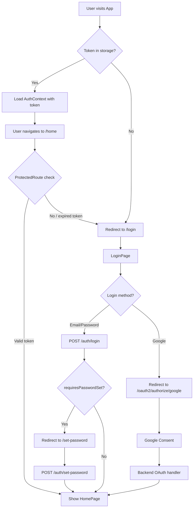
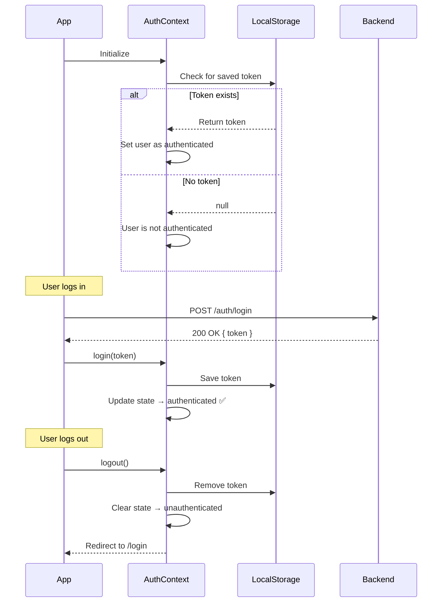
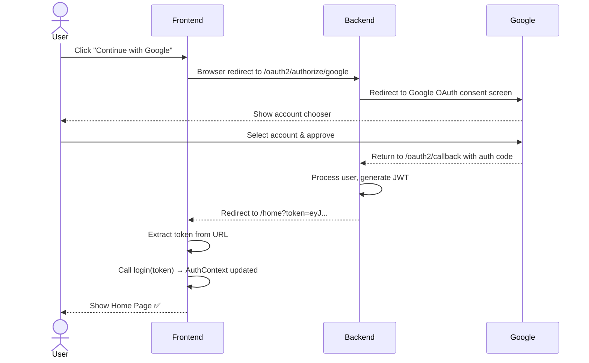

# 🎨 Login System — Frontend Documentation

> **Audience:** Developers, contributors, and curious readers.
> This guide explains the React frontend — what it shows, how it works, and how to run it.

---

## 📖 Table of Contents
1. [What is this?](#1-what-is-this)
2. [Tech Stack](#2-tech-stack)
3. [Project Structure](#3-project-structure)
4. [Pages & Routes](#4-pages--routes)
5. [Authentication State (AuthContext)](#5-authentication-state-authcontext)
6. [API Communication](#6-api-communication)
7. [Design System](#7-design-system)
8. [Key User Flows](#8-key-user-flows)
9. [Environment Variables](#9-environment-variables)
10. [Running Locally](#10-running-locally)
11. [Coding Conventions](#11-coding-conventions)
12. [Flow Diagrams](#12-flow-diagrams)

---

## 1. What is this?

This is the **React frontend** for the Login System. It provides:
- ✅ A Login page
- ✅ A Registration page
- ✅ A Set Password page (shown when an OAuth user logs in via email for the first time)
- ✅ A Home page (currently showing "Under Maintenance")
- ✅ Google OAuth login button
- ✅ Protected routes — unauthenticated users cannot access the home page

---

## 2. Tech Stack

| Layer | Technology |
|---|---|
| UI Framework | React 18 |
| Routing | React Router DOM v6 |
| HTTP Client | Axios |
| Auth State | React Context API |
| Styling | CSS (Vanilla, no frameworks) |
| Build Tool | Create React App / Vite |

---

## 3. Project Structure

```
login-system-frontend/
├── public/
│   └── index.html
└── src/
    ├── pages/
    │   ├── LoginPage.jsx         # Login form
    │   ├── RegisterPage.jsx      # Registration form
    │   ├── SetPasswordPage.jsx   # Set password (account linking)
    │   └── HomePage.jsx          # "Under Maintenance" home
    ├── components/
    │   ├── AuthButton.jsx        # Reusable styled button
    │   └── InputField.jsx        # Reusable form input
    ├── context/
    │   └── AuthContext.jsx       # Global auth state (token, user)
    ├── services/
    │   └── authService.js        # All API calls to the backend
    ├── routes/
    │   └── ProtectedRoute.jsx    # Wrapper that blocks unauthenticated access
    ├── styles/
    │   └── global.css            # Design tokens and base styles
    └── App.jsx                   # Root component with routing
```

---

## 4. Pages & Routes

| Route | Page | Protected? | Description |
|---|---|---|---|
| `/login` | `LoginPage` | ❌ No | Email/password login or Google OAuth |
| `/register` | `RegisterPage` | ❌ No | Create a new account |
| `/set-password` | `SetPasswordPage` | ❌ No | Set a password after OAuth registration |
| `/home` | `HomePage` | ✅ Yes | Redirects to `/login` if not authenticated |
| `/*` | Redirect | — | Unknown routes redirect to `/login` |

---

## 5. Authentication State (AuthContext)

The `AuthContext` is a global store for the current user's authentication state. It is available to every component in the app.

### What it holds

```js
{
  token: "eyJhbGci...",   // The JWT received after login
  user: {                  // Basic user info decoded from token
    email: "akash@example.com"
  },
  login(token),            // Call this after a successful login
  logout()                 // Clears state and redirects to /login
}
```

### How it works

1. On app load, `AuthContext` checks `localStorage` for an existing token.
2. If a token is found and is not expired, the user is treated as **logged in**.
3. After a successful API login, `login(token)` is called — it saves the token and updates state.
4. `logout()` removes the token from state and storage and redirects to `/login`.

---

## 6. API Communication

All backend calls are made through `services/authService.js`. This keeps API logic in one place.

### Base URL

Set via the environment variable `REACT_APP_API_URL` (default: `http://localhost:8080`).

### Available Functions

| Function | Method | Endpoint | Description |
|---|---|---|---|
| `register(name, email, password)` | POST | `/api/v1/auth/register` | Register a new user |
| `login(email, password)` | POST | `/api/v1/auth/login` | Login with email/password |
| `setPassword(email, newPassword)` | POST | `/api/v1/auth/set-password` | Set password for OAuth users |
| `getProfile()` | GET | `/api/v1/users/me` | Fetch current user profile (uses JWT) |

### 401 Handling

Axios is configured with an **interceptor** — if any response returns `401 Unauthorized`, the user is automatically logged out and redirected to `/login`.

---

## 7. Design System

The UI is inspired by clean, modern login forms (think Instagram/Notion style).

### Color Tokens

| Token | Hex Value | Usage |
|---|---|---|
| Background | `#f0f0f0` | Page background (silver/grey) |
| Primary Button | `#1a3a6b` | Main action buttons (dark blue) |
| Button Text | `#ffffff` | Text on dark blue buttons |
| Input Border | `#cccccc` | Input field borders |
| Input Focus | `#1a3a6b` | Input highlight on focus |
| Error | `#cc0000` | Error messages |

### Component Rules
- All buttons are **fully rounded** (`border-radius: 50px`)
- Inputs have subtle shadows and rounded corners
- Forms are **centered** on the page with a max-width of 400px
- Typography: clean sans-serif (`Inter` or system default)
- No heavy frameworks — all styles are in `global.css`

---

## 8. Key User Flows

### 8.1 New User Registers
1. User visits `/register`
2. Fills in Name, Email, Password
3. Frontend calls `authService.register()`
4. On success → Backend returns a JWT → `login(token)` is called → Redirect to `/home`
5. On failure → Error message shown inline

### 8.2 User Logs In
1. User visits `/login`
2. Enters Email + Password
3. Frontend calls `authService.login()`
4. **If `requiresPasswordSet: true`** → Redirect to `/set-password` (see 8.3)
5. **Otherwise** → `login(token)` called → Redirect to `/home`

### 8.3 OAuth User Sets Password
1. User arrives at `/set-password` (redirected from login)
2. Enters new password
3. Frontend calls `authService.setPassword()`
4. On success → `login(token)` called → Redirect to `/home`

### 8.4 Google Login
1. User clicks "Continue with Google" on `/login`
2. Browser redirects to `GET /oauth2/authorize/google` (backend URL)
3. After Google consent, backend issues a JWT and redirects back to the frontend
4. Frontend extracts the JWT from the URL and calls `login(token)`

### 8.5 Protected Route Access
1. User navigates to `/home`
2. `ProtectedRoute` checks if a valid token exists in `AuthContext`
3. **No token** → Redirect to `/login`
4. **Valid token** → Show `HomePage`

---

## 9. Environment Variables

Create a `.env` file in the `login-system-frontend/` root:

```env
REACT_APP_API_URL=http://localhost:8080
```

> ⚠️ Never commit `.env` to Git. It is listed in `.gitignore`.

---

## 10. Running Locally

### Option A: With Docker (Recommended)
```bash
# From the project root
docker-compose up --build
```
The frontend will be available at `http://localhost:3000`.

### Option B: Without Docker
**Prerequisites:** Node.js 18+, npm

```bash
cd login-system-frontend
npm install
npm start
```

The app will open automatically at `http://localhost:3000`.

---

## 11. Coding Conventions

| What | Convention |
|---|---|
| Pages | `LoginPage.jsx`, `HomePage.jsx` (PascalCase) |
| Components | `AuthButton.jsx`, `InputField.jsx` |
| Services | `authService.js` (camelCase) |
| Context | `AuthContext.jsx` |
| API base URL | Always from `REACT_APP_API_URL` env var |
| Error handling | Always show user-friendly messages — never raw API errors |
| Token storage | Memory (React state) preferred; `localStorage` as fallback |

---

## 12. Flow Diagrams

### 12.1 Full Page Routing Flow



---

### 12.2 AuthContext Lifecycle



---

### 12.3 Google OAuth Frontend Flow


