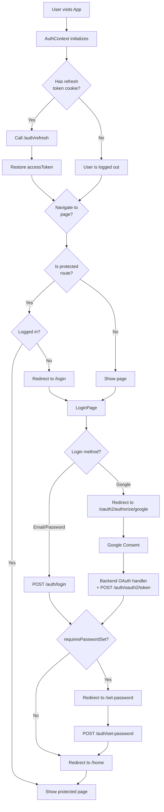
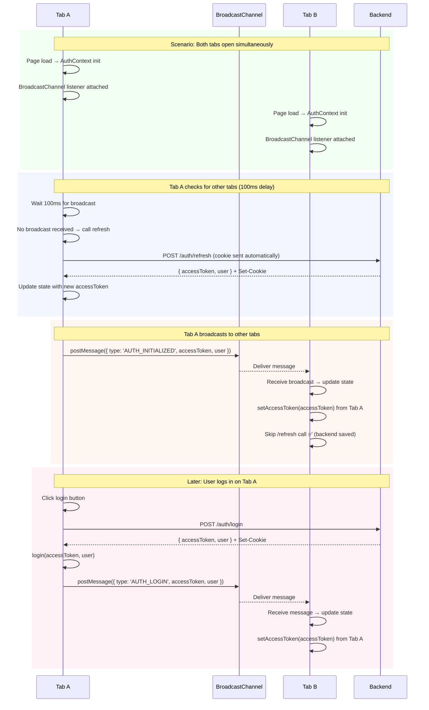

# 🎨 Login System — Frontend Documentation

> **Audience:** Developers, contributors, and curious readers.
> This guide explains the React frontend — what it shows, how it works, and how to run it.

---

## 📖 Table of Contents
1. [What is this?](#1-what-is-this)
2. [Tech Stack](#2-tech-stack)
3. [Project Structure](#3-project-structure)
4. [Pages & Routes](#4-pages--routes)
5. [Authentication State (AuthContext)](#5-authentication-state-authcontext)
6. [API Communication](#6-api-communication)
7. [Design System](#7-design-system)
8. [Key User Flows](#8-key-user-flows)
9. [Environment Variables](#9-environment-variables)
10. [Running Locally](#10-running-locally)
11. [Coding Conventions](#11-coding-conventions)
12. [Flow Diagrams](#12-flow-diagrams)

---

## 1. What is this?

This is the **React frontend** for the Login System. It provides:
- ✅ A Login page
- ✅ A Registration page
- ✅ A Set Password page (shown when an OAuth user logs in via email for the first time)
- ✅ A Home page (currently showing "Under Maintenance")
- ✅ Google OAuth login button
- ✅ Protected routes — unauthenticated users cannot access the home page

---

## 2. Tech Stack

| Layer | Technology |
|---|---|
| UI Framework | React 18 |
| Routing | React Router DOM v6 |
| HTTP Client | Axios |
| Auth State | React Context API |
| Styling | CSS (Vanilla, no frameworks) |
| Build Tool | Create React App / Vite |

---

## 3. Project Structure

```
frontend/auth-service-mfe/
├── public/
│   └── index.html
└── src/
    ├── pages/
    │   ├── LoginPage.jsx         # Login form
    │   ├── RegisterPage.jsx      # Registration form
    │   ├── SetPasswordPage.jsx   # Set password (account linking)
    │   └── HomePage.jsx          # "Under Maintenance" home
    ├── components/
    │   ├── AuthButton.jsx        # Reusable styled button
    │   └── InputField.jsx        # Reusable form input
    ├── context/
    │   └── AuthContext.jsx       # Global auth state (token, user)
    ├── services/
    │   └── authService.js        # All API calls to the backend
    ├── routes/
    │   └── ProtectedRoute.jsx    # Wrapper that blocks unauthenticated access
    ├── styles/
    │   └── global.css            # Design tokens and base styles
    └── App.jsx                   # Root component with routing
```

---

## 3.5 Token Storage Strategy (Phase 1 + Phase 2)

The system uses a **hybrid token storage approach** to balance security and usability:

| Token | Storage | Lifetime | Visibility | How It's Used |
|---|---|---|---|---|
| **Access Token** | React memory (volatile) | 1 hour | Visible to JS (in `AuthContext`) | Sent as `Authorization: Bearer` header with each protected request |
| **Refresh Token** | HttpOnly cookie (persistent) | 7 days | Hidden from JS (browser-managed only) | Browser sends automatically with `/auth/refresh` calls |

### Why This Combination?

**Access Token in Memory:**
- Pros: Short-lived, auto-clears on page reload, fast access
- Cons: Lost when user refreshes page (but cookie restores it immediately)
- Risk: Safe from XSS (attacker gets a 1-hour token, not a 7-day one)

**Refresh Token in HttpOnly Cookie:**
- Pros: Can't be stolen via XSS, auto-sent by browser, CSRF-protected
- Cons: Requires `withCredentials: true` in Axios
- Risk: Protected by Secure + SameSite=Strict attributes

### Security Model Summary

```
User's Browser                  Backend
    |                            |
    |-- POST /auth/login -------->|
    |<-- { accessToken } ---------|
    |<-- Set-Cookie: refreshToken (HttpOnly, Secure, SameSite=Strict)
    |                            |
    |-- Stores accessToken in React state
    |-- Browser stores cookie (HTTP only, cannot JS access)
    |                            |
    |-- (1 hour later) accessToken expires
    |-- POST /auth/refresh ------->| (cookie sent automatically)
    |<-- { new accessToken } ----|
    |<-- Set-Cookie: refreshToken (new value, rotated)
    |                            |
    |-- XSS Attack! Malicious JS tries to steal token
    |     → Can only access accessToken in React state (1 hour)
    |     → Cannot access refreshToken (HttpOnly blocks it)
    |     → Cannot refresh for more than 1 hour
    |                            |
    |-- User clicks logout
    |-- POST /auth/logout ------->|
    |<-- { accessToken cleared } -|
    |<-- Set-Cookie: refreshToken="" (MaxAge=0, clears cookie)
    |                            |
    |-- React state cleared
    |-- Cookie deleted by browser
    |-- User logged out ✅
```

---

## 4. Pages & Routes

| Route | Page | Protected? | Description |
|---|---|---|---|
| `/login` | `LoginPage` | ❌ No | Email/password login or Google OAuth |
| `/register` | `RegisterPage` | ❌ No | Create a new account |
| `/set-password` | `SetPasswordPage` | ❌ No | Set a password after OAuth registration |
| `/home` | `HomePage` | ✅ Yes | Redirects to `/login` if not authenticated |
| `/*` | Redirect | — | Unknown routes redirect to `/login` |

---

## 5. Authentication State (AuthContext)

The `AuthContext` is a global store for the current user's authentication state. It is available to every component in the app.

### What it holds

```js
{
  accessToken: "eyJhbGci...",    // The JWT in memory (never persisted)
  user: {                         // User info from latest auth response
    id: "550e8400-...",
    name: "Akash Beura",
    email: "akash@example.com",
    provider: "LOCAL",
    pictureUrl: "..."             // For OAuth users
  },
  isAuthenticated: boolean,       // true if accessToken exists
  initialized: boolean,           // false while restoring from cookie
  login(token, userData),         // Call after successful login
  logout()                        // Revokes server session & clears state
}
```

### How it works (Phase 1 + Phase 2)

1. **On app load**, `AuthContext` does **not** check `localStorage` (no longer used).
2. Instead, it calls `POST /auth/refresh` with **no body**; browser sends the refresh token cookie automatically.
3. If a valid refresh token exists in the cookie, the backend returns a new `accessToken` in the response.
4. `AuthContext` stores the `accessToken` in **memory only** (volatile, cleared on page reload).
5. After a successful API login/register/OAuth, `login(accessToken, userData)` is called.
6. `logout()` calls the backend to revoke refresh tokens, clears the `accessToken`, and the browser **automatically clears** the cookie.

### Phase 1: BroadcastChannel Multi-Tab Sync

When multiple browser tabs are open:
1. **Tab A** loads and calls `/auth/refresh` → gets an `accessToken`
2. **Tab B** loads and waits 100ms to see if another tab is already restoring
3. **If Tab A broadcasts its `accessToken`**, Tab B receives it via `BroadcastChannel('auth')` and skips the backend call
4. **On login/logout**, the acting tab broadcasts to all other tabs, keeping them in sync
5. **Benefits**: Eliminates race conditions during simultaneous refresh token rotation

---

## 6. API Communication

All backend calls are made through `services/authService.js`. This keeps API logic in one place.

### Base URL & Credentials

Set via the environment variable `REACT_APP_API_URL` (default: `http://localhost:8080/api/v1`).

**Phase 2 Update:** Axios is configured with `withCredentials: true`, allowing the browser to:
- Automatically include the refresh token cookie with `/auth/refresh` calls
- Store and update the refresh token cookie from `Set-Cookie` response headers

### Available Functions

| Function | Method | Endpoint | Request | Response |
|---|---|---|---|---|
| `register(name, email, password, ...)` | POST | `/api/v1/auth/register` | Body: credentials + optional profile | `{ accessToken, user }` + cookie |
| `login(email, password)` | POST | `/api/v1/auth/login` | Body: credentials | `{ accessToken, user }` + cookie |
| `refresh()` | POST | `/api/v1/auth/refresh` | **No body** (cookie sent automatically) | `{ accessToken, user }` + new cookie |
| `setPassword(password, confirmPassword)` | POST | `/api/v1/auth/set-password` | Body: password + Bearer token | `{ accessToken, user }` + cookie |
| `logout(accessToken)` | POST | `/api/v1/auth/logout` | Bearer token only | 204 No Content + cookie cleared |

### Cookie Management

- **No explicit code required** — Axios + browser handle cookies automatically
- The refresh token cookie is **HttpOnly** (JavaScript cannot read it)
- **DevTools tip**: Open DevTools → Application tab → Cookies → see `refreshToken` cookie with HttpOnly flag

### 401 Handling

Axios is configured with an **interceptor**. When any endpoint returns `401`:
1. The interceptor detects the error
2. AuthContext logs out the user
3. Redirect to `/login` is triggered
4. Browser automatically clears the refresh token cookie

---

## 7. Design System

The UI is inspired by clean, modern login forms (think Instagram/Notion style).

### Color Tokens

| Token | Hex Value | Usage |
|---|---|---|
| Background | `#f0f0f0` | Page background (silver/grey) |
| Primary Button | `#1a3a6b` | Main action buttons (dark blue) |
| Button Text | `#ffffff` | Text on dark blue buttons |
| Input Border | `#cccccc` | Input field borders |
| Input Focus | `#1a3a6b` | Input highlight on focus |
| Error | `#cc0000` | Error messages |

### Component Rules
- All buttons are **fully rounded** (`border-radius: 50px`)
- Inputs have subtle shadows and rounded corners
- Forms are **centered** on the page with a max-width of 400px
- Typography: clean sans-serif (`Inter` or system default)
- No heavy frameworks — all styles are in `global.css`

---

## 8. Key User Flows

### 8.1 New User Registers

```
Frontend                Backend              Browser
  |                        |                    |
  |-- Fill form ---------->|                    |
  |-- POST /auth/register  |-- Validate ------->|
  |<-- 201 Created --------|                    |
  |   { accessToken, user }|<-- User created    |
  |<-- Set-Cookie: refreshToken; HttpOnly; ...
  |                        |                    |
  |-- Store accessToken in React state
  |-- Browser stores refreshToken cookie automatically
  |-- Redirect to /home ✅
```

1. User visits `/register` and fills in Name, Email, Password
2. Frontend calls `authService.register()`
3. Backend validates, hashes password, stores user
4. Backend returns `{ accessToken, user }` + sets refresh token cookie
5. Browser automatically stores the httpOnly cookie
6. Frontend calls `login(accessToken, userData)` → updates `AuthContext`
7. Redirect to `/home`

### 8.2 User Logs In (Phase 2 Update)

```
Frontend                Backend              Browser
  |                        |                    |
  |-- Enter credentials --->|                    |
  |-- POST /auth/login      |-- Validate ------->|
  |<-- 200 OK --------------|                    |
  |   { accessToken, user }|<-- User found      |
  |<-- Set-Cookie: refreshToken; HttpOnly; ...
  |                        |                    |
  |-- Store accessToken in React state
  |-- Browser stores refreshToken cookie
  |-- Redirect to /home ✅
```

1. User visits `/login` and enters Email + Password
2. Frontend calls `authService.login()`
3. **If `requiresPasswordSet: true`** → Redirect to `/set-password` (see 8.3)
4. **Otherwise** → `login(accessToken, userData)` called
5. Redirect to `/home`
6. Browser cookie is now active for future refresh calls

### 8.3 OAuth User Sets Password

1. User arrives at `/set-password` (redirected from login)
2. Enters new password
3. Frontend calls `authService.setPassword()` with Bearer token from previous OAuth login
4. Backend validates, hashes password, saves to user
5. Backend returns new tokens + refreshes cookie
6. Frontend calls `login()` → Redirect to `/home`

### 8.4 Google OAuth Login

1. User clicks "Continue with Google" on `/login`
2. Frontend redirects to backend: `GET /oauth2/authorize/google`
3. Backend redirects to Google's OAuth screen
4. User grants permission
5. Google redirects back to backend's `/oauth2/callback` with auth code
6. Backend exchanges code for Google profile → checks/creates user
7. Backend generates JWT + refresh token
8. Backend redirects to `/oauth/callback?code=<opaque>` (opaque code, not tokens!)
9. Frontend exchanges code: `POST /api/v1/auth/oauth2/token { code: "..." }`
10. Backend returns `{ accessToken, user, requiresPasswordSet }` + sets cookie
11. **If `requiresPasswordSet=false`** → Redirect to `/home` ✅
12. **If `requiresPasswordSet=true`** → Stay on `/set-password` ⚠️

### 8.5 Protected Route Access + Automatic Refresh (Phase 1 + Phase 2)

```
User loads /home
  |
  └─ AuthContext initializes
      |
      ├─ BroadcastChannel listens for other tabs
      |
      └─ Check if another tab is restoring
         |
         ├─ If yes, wait 100ms for broadcast
         |
         └─ If no, call POST /auth/refresh (no body!)
             |
             ├─ Browser sends: Cookie: refreshToken=<uuid>
             |
             ├─ Backend validates cookie, rotates token
             |
             └─ Return: { accessToken, user }
                |
                ├─ Set-Cookie: refreshToken=<new-uuid>; HttpOnly; ...
                |
                └─ Broadcast to other tabs via BroadcastChannel
                   |
                   ├─ Tab B receives broadcast
                   ├─ Tab B updates accessToken in state
                   └─ No backend call needed on Tab B ✅
  |
  ├─ ProtectedRoute checks if accessToken exists
  ├─ Yes → Show HomePage
  └─ No → Redirect to /login
```

**Key improvement (Phase 1):** When multiple tabs open simultaneously:
- Tab A calls refresh, gets tokens, broadcasts
- Tab B receives broadcast, skips refresh call, saves backend resources
- Eliminates race conditions during token rotation

---

## 9. Environment Variables

Create a `.env` file in the `frontend/auth-service-mfe/` root:

```env
REACT_APP_API_URL=http://localhost:8080
```

> ⚠️ Never commit `.env` to Git. It is listed in `.gitignore`.

---

## 10. Running Locally

### Option A: With Docker (Recommended)
```bash
# From the project root
docker-compose up --build
```
The frontend will be available at `http://localhost:3000`.

### Option B: Without Docker
**Prerequisites:** Node.js 18+, npm

```bash
cd frontend/auth-service-mfe
npm install
npm start
```

The app will open automatically at `http://localhost:3000`.

---

## 11. Coding Conventions

| What | Convention |
|---|---|
| Pages | `LoginPage.jsx`, `HomePage.jsx` (PascalCase) |
| Components | `AuthButton.jsx`, `InputField.jsx` |
| Services | `authService.js` (camelCase) |
| Context | `AuthContext.jsx` |
| API base URL | Always from `REACT_APP_API_URL` env var |
| Error handling | Always show user-friendly messages — never raw API errors |
| **Token storage (Phase 2)** | **Access token in React state only; never use localStorage** |
| **Refresh token** | **Never touch — browser manages httpOnly cookie automatically** |
| **Axios config** | **Always use `withCredentials: true` to enable cookie sending** |
| **BroadcastChannel** | Use for multi-tab auth state sync; gracefully degrade if unsupported |

---

## 11.5 Development Notes (Phase 1 + Phase 2)

### Debugging Token State

**In browser DevTools:**
```
Console:
  → Open Application tab → Cookies
  → Look for "refreshToken" with HttpOnly flag (cannot be accessed by JS)
  → Refresh token value is hidden (browser security)

  → Open Console
  → Type: document.cookie
  → Result: (nothing about refreshToken, because it's HttpOnly)
```

**Checking AuthContext state:**
```
React DevTools:
  → Open Components tab
  → Find AuthProvider
  → Look at the value prop:
    {
      accessToken: "eyJ...",      // visible in React
      user: { ... },               // visible in React
      isAuthenticated: true,
      initialized: true
    }
```

### Debugging BroadcastChannel (Multi-Tab Sync)

**Open two tabs side by side:**
```javascript
// In Tab A's console
const bc = new BroadcastChannel('auth');
bc.onmessage = (e) => console.log('Tab A received:', e.data);

// In Tab B, trigger a login
// Tab A console will show: Tab A received: { type: 'AUTH_LOGIN', accessToken: '...', user: {...} }
```

### Common Issues & Fixes

| Issue | Cause | Fix |
|---|---|---|
| `401 Unauthorized` on protected routes | Access token expired, refresh token missing/invalid | Check browser cookies; ensure backend is setting `Set-Cookie` header |
| Cookie not being sent to backend | `withCredentials: true` not set in Axios | Verify `apiClient.js` has `withCredentials: true` |
| `Set-Cookie` header ignored by browser | CORS `allowCredentials: false` on backend | Backend must have `allowCredentials: true` in CORS config |
| Multiple calls to `/auth/refresh` simultaneously | BroadcastChannel not working or tab collision | Check browser console for BroadcastChannel errors; add logging to `AuthContext` |
| Token not persisting across page reload | Expected behavior (access token in memory) | Normal — refresh from cookie restores session automatically |

### Testing Multi-Tab Behavior

1. **Test Scenario 1: Simultaneous Tab Opens**
   - Open Tab A → Logs in
   - Quickly open Tab B
   - Expected: Both tabs show logged-in state; only 1 refresh call made
   - Verify: Tab B received broadcast from Tab A

2. **Test Scenario 2: Logout in One Tab**
   - Tab A & B both logged in
   - Click logout in Tab A
   - Expected: Tab B also logs out (via BroadcastChannel)
   - Verify: Both cookies cleared; both tabs show login page

3. **Test Scenario 3: Refresh Token Rotation**
   - Tab A logged in, waiting for token expiry
   - Access token expires (or call `/auth/refresh` manually)
   - Expected: New access token returned; new cookie set
   - Verify: DevTools shows refreshToken cookie value changed

---

## 12. Flow Diagrams

### 12.1 Full Page Routing Flow (Phase 2 Update)


```mermaid
flowchart TD
    A[User visits App] --> B[AuthContext initializes]
    B --> C{Has refresh<br/>token cookie?}
    C -- Yes --> D[Call /auth/refresh]
    C -- No --> E[User is logged out]
    D --> F[Restore accessToken]
    F --> G{Navigate to<br/>page?}
    E --> G
    G --> H{Is protected<br/>route?}
    H -- Yes --> I{Logged in?}
    I -- Yes --> J[Show protected page]
    I -- No --> K[Redirect to /login]
    H -- No --> L[Show page]
    K --> M[LoginPage]
    L --> M
    M --> N{Login method?}
    N -- Email/Password --> O[POST /auth/login]
    N -- Google --> P[Redirect to /oauth2/authorize/google]
    O --> Q{requiresPasswordSet?}
    Q -- Yes --> R[Redirect to /set-password]
    Q -- No --> S[Redirect to /home]
    P --> T[Google Consent]
    T --> U[Backend OAuth handler<br/>+ POST /auth/oauth2/token]
    U --> Q
    R --> V[POST /auth/set-password]
    V --> S
    S --> J
```

---

### 12.2 App Initialization & Page Load (Phase 1 + Phase 2 Update)

```mermaid
sequenceDiagram
    actor User
    participant React App
    participant AuthContext
    participant Browser Cookies
    participant Backend

    User->>React App: Load page (fresh or reload)
    React App->>AuthContext: Initialize AuthProvider
    AuthContext->>AuthContext: State: { accessToken: null, initialized: false }

    rect rgb(240, 245, 255)
        Note over AuthContext,Backend: Phase 2: Check for refresh token cookie
        AuthContext->>AuthContext: Setup BroadcastChannel listener
        AuthContext->>AuthContext: Wait 100ms for other tab broadcasts
    end

    alt Another tab is restoring (broadcasts within 100ms)
        AuthContext->>AuthContext: Receive AUTH_INITIALIZED broadcast
        AuthContext->>AuthContext: setAccessToken(from broadcast)
        AuthContext->>AuthContext: setInitialized(true) ✅ No backend call
    else No broadcast received
        AuthContext->>Backend: POST /api/v1/auth/refresh
        Note over Browser Cookies,Backend: Browser sends: Cookie: refreshToken=<uuid>
        Backend->>Backend: Validate cookie, issue new tokens
        Backend-->>AuthContext: 200 OK { accessToken, user }
        Backend-->>Browser Cookies: Set-Cookie: refreshToken=<new-uuid>; HttpOnly; ...
        AuthContext->>AuthContext: setAccessToken + setUser
        AuthContext->>AuthContext: Broadcast AUTH_INITIALIZED to other tabs
        AuthContext->>AuthContext: setInitialized(true) ✅
    end

    React App->>React App: Render page (no loading spinner anymore)

    alt User is logged in
        React App->>React App: Show HomePage / Protected Routes
    else User not logged in
        React App->>React App: Show LoginPage
    end
```

### 12.3 AuthContext Lifecycle — Login / Logout

---

### 12.3 Multi-Tab Sync Flow (Phase 1 BroadcastChannel)


```mermaid
sequenceDiagram
    participant Tab A
    participant BroadcastChannel
    participant Tab B
    participant Backend

    rect rgb(240, 255, 240)
        Note over Tab A,Backend: Scenario: Both tabs open simultaneously
        Tab A->>Tab A: Page load → AuthContext init
        Tab A->>Tab A: BroadcastChannel listener attached
        Tab B->>Tab B: Page load → AuthContext init
        Tab B->>Tab B: BroadcastChannel listener attached
    end

    rect rgb(240, 245, 255)
        Note over Tab A,Backend: Tab A checks for other tabs (100ms delay)
        Tab A->>Tab A: Wait 100ms for broadcast
        Tab A->>Tab A: No broadcast received → call refresh
        Tab A->>Backend: POST /auth/refresh (cookie sent automatically)
        Backend-->>Tab A: { accessToken, user } + Set-Cookie
        Tab A->>Tab A: Update state with new accessToken
    end

    rect rgb(255, 245, 240)
        Note over Tab A,Backend: Tab A broadcasts to other tabs
        Tab A->>BroadcastChannel: postMessage({ type: 'AUTH_INITIALIZED', accessToken, user })
        BroadcastChannel-->>Tab B: Deliver message
        Tab B->>Tab B: Receive broadcast → update state
        Tab B->>Tab B: setAccessToken(accessToken) from Tab A
        Tab B->>Tab B: Skip /refresh call ✅ (backend saved)
    end

    rect rgb(255, 240, 245)
        Note over Tab A,Backend: Later: User logs in on Tab A
        Tab A->>Tab A: Click login button
        Tab A->>Backend: POST /auth/login
        Backend-->>Tab A: { accessToken, user } + Set-Cookie
        Tab A->>Tab A: login(accessToken, user)
        Tab A->>BroadcastChannel: postMessage({ type: 'AUTH_LOGIN', accessToken, user })
        BroadcastChannel-->>Tab B: Deliver message
        Tab B->>Tab B: Receive message → update state
        Tab B->>Tab B: setAccessToken(accessToken) from Tab A
    end
```

### 12.4 Google OAuth Frontend Flow (Phase 2 Update)

```mermaid
sequenceDiagram
    actor User
    participant Frontend
    participant Backend
    participant Google
    participant Browser Cookies

    User->>Frontend: Click "Continue with Google"
    Frontend->>Backend: Browser redirect to /oauth2/authorize/google
    Backend->>Google: Redirect to Google OAuth consent screen
    Google-->>User: Show account chooser
    User->>Google: Select account & approve
    Google-->>Backend: Return to /oauth2/callback with auth code
    Backend->>Backend: Process user, generate JWT + refresh token
    Backend-->>Frontend: Redirect to /oauth/callback?code=<opaque>
    Frontend->>Backend: POST /api/v1/auth/oauth2/token { code: "..." }
    Backend-->>Frontend: 200 OK { accessToken, user, requiresPasswordSet }
    Backend-->>Browser Cookies: Set-Cookie: refreshToken=<uuid>; HttpOnly; Secure; SameSite=Strict
    Browser Cookies-->>Browser Cookies: Store httpOnly cookie
    Frontend->>Frontend: Call login(accessToken, user)
    alt requiresPasswordSet = false
        Frontend-->>User: Redirect to /home ✅
    else requiresPasswordSet = true
        Frontend-->>User: Redirect to /set-password ⚠️
    end
```

### 12.5 HttpOnly Cookie Token Refresh Flow (Phase 2)

```mermaid
sequenceDiagram
    actor User
    participant Frontend
    participant Browser
    participant Backend

    rect rgb(240, 245, 255)
        Note over Frontend,Backend: Initial state: accessToken in memory, refreshToken in cookie
        Frontend->>Frontend: accessToken: "eyJ..." (in React state)
        Browser->>Browser: Cookie: refreshToken="uuid" (HttpOnly, not accessible to JS)
    end

    rect rgb(245, 240, 255)
        Note over Frontend,Backend: Time passes... (1 hour) accessToken expires
        Frontend->>Frontend: Check if token expired
        Frontend->>Frontend: Yes! Call refresh()
    end

    rect rgb(240, 255, 240)
        Note over Frontend,Backend: Frontend calls /auth/refresh (no body needed!)
        Frontend->>Backend: POST /api/v1/auth/refresh (no request body)
        Note over Browser,Backend: Browser automatically includes: Cookie: refreshToken="uuid"
        Browser->>Backend: (transparent to Frontend)
        Backend->>Backend: Read cookie, validate token
        Backend->>Backend: Delete old token, generate new tokens (atomic)
        Backend-->>Frontend: 200 OK { accessToken: "newEyJ..." }
        Backend-->>Browser: Set-Cookie: refreshToken="new-uuid"; HttpOnly; Secure; SameSite=Strict
    end

    rect rgb(255, 240, 240)
        Note over Frontend,Backend: Frontend updates state with new tokens
        Frontend->>Frontend: setAccessToken("newEyJ...")
        Browser->>Browser: Browser stores new cookie (replaces old one)
        Frontend->>Frontend: Ready for next request ✅
    end

    rect rgb(255, 250, 240)
        Note over Frontend,Backend: XSS attack attempted!
        Frontend->>Frontend: Malicious script: fetch(API) with accessToken
        Note over Frontend: ✅ Attacker only gets 1-hour accessToken, not the 7-day refreshToken
        Note over Frontend: ✅ Token rotation is atomic — can't replay old tokens
        Note over Frontend: ✅ SameSite=Strict prevents CSRF usage
    end
```

### 12.6 AuthContext Lifecycle — Login / Logout

```mermaid
sequenceDiagram
    participant User
    participant Frontend
    participant AuthContext
    participant Browser Cookies
    participant Backend

    rect rgb(240, 255, 240)
        Note over User,Backend: User logs in
        User->>Frontend: Enter Email + Password, click Login
        Frontend->>Backend: POST /api/v1/auth/login { email, password }
        Backend->>Backend: Validate credentials
        Backend-->>Frontend: 200 OK { accessToken, user }
        Backend-->>Browser Cookies: Set-Cookie: refreshToken=<uuid>; HttpOnly; ...
        Frontend->>Frontend: dispatch login(accessToken, user)
        AuthContext->>AuthContext: setAccessToken(accessToken)
        AuthContext->>AuthContext: setUser(user)
        AuthContext->>AuthContext: Broadcast to other tabs
        Frontend-->>User: Redirect to /home ✅
    end

    rect rgb(255, 245, 240)
        Note over User,Backend: User logs out
        User->>Frontend: Click logout button
        Frontend->>AuthContext: logout()
        AuthContext->>Backend: POST /api/v1/auth/logout (with Bearer token)
        Backend->>Backend: Delete user's refresh tokens from DB
        Backend-->>Frontend: 204 No Content
        Backend-->>Browser Cookies: Set-Cookie: refreshToken="" (MaxAge=0)
        AuthContext->>AuthContext: setAccessToken(null)
        AuthContext->>AuthContext: setUser(null)
        Browser Cookies-->>Browser Cookies: Delete refreshToken cookie
        AuthContext->>AuthContext: Broadcast AUTH_LOGOUT to other tabs
        Frontend-->>User: Redirect to /login ✅
    end
```
