# 🧠 Prompts Guide — How to Build This Project with Claude

> This guide explains **how this project was built using Claude's agent system**, and gives you the **exact step-by-step prompts** to recreate it from scratch — efficiently, without wasting tokens.

---

## 📖 Table of Contents
1. [How This Project Uses Claude](#1-how-this-project-uses-claude)
2. [The Agent System Explained](#2-the-agent-system-explained)
3. [The Skills System Explained](#3-the-skills-system-explained)
4. [Token Optimisation Strategy](#4-token-optimisation-strategy)
5. [Step-by-Step Prompts](#5-step-by-step-prompts)
   - [Step 0 — Setup](#step-0--initial-setup-one-time)
   - [Step 1 — Architecture](#step-1--backend-architecture)
   - [Step 2 — Security Layer](#step-2--security-layer)
   - [Step 3 — Backend Business Logic](#step-3--backend-business-logic)
   - [Step 4 — Frontend Scaffold](#step-4--frontend-scaffold)
   - [Step 5 — Docker & DevOps](#step-5--docker--devops)
   - [Step 6 — Review & Audit](#step-6--review--audit)
6. [How to Read Agent Responses](#6-how-to-read-agent-responses)
7. [Flow Diagram](#7-flow-diagram)

---

## 1. How This Project Uses Claude

This project treats Claude not as a single all-knowing AI, but as a **team of specialists**. Each specialist knows exactly what they are responsible for and — critically — what they are **not** allowed to do.

This mirrors how real engineering teams work:

| Real Team Role | Claude Agent |
|---|---|
| System Architect | `backend-architect` |
| Backend Developer | `backend-dev` |
| Security Engineer | `security-specialist` |
| Frontend Developer | `frontend-dev` |
| DevOps Engineer | `devops-observability` |
| Tech Lead / Code Reviewer | `reviewer` |

By separating concerns, each agent works with a **small, focused context** — which saves tokens, improves output quality, and prevents agents from overstepping their boundaries.

---

## 2. The Agent System Explained

Agents live in `.claude/agents/`. Each agent file is a markdown file with:
1. A **YAML frontmatter** specifying which model to use
2. A **Role** section describing the agent's purpose
3. A **Responsibilities** section listing what it does
4. A **Constraints** section listing what it must NOT do
5. An **Output Format** section for consistency

### Agent Roster & Model Assignments

| Agent File | Model | Why This Model |
|---|---|---|
| `backend-architect.md` | `claude-sonnet-4-5` | Architecture requires strong reasoning — but not opus-level cost |
| `backend-dev.md` | `claude-sonnet-4-5` | Complex implementation following contracts |
| `security-specialist.md` | `claude-sonnet-4-5` | Security is nuanced; needs careful judgment |
| `reviewer.md` | `claude-opus-4-5` | Final quality gate — deserves the most powerful model |
| `frontend-dev.md` | `claude-haiku-4-5` | UI generation is well-defined and routine — fast and cheap |
| `devops-observability.md` | `claude-haiku-4-5` | Config file generation is low-complexity |

### The Key Principle: **Right model for the right job**

Using `opus` for everything is expensive and slow. Using `haiku` for everything produces poor security code. Match the model to the cognitive complexity of the task.

### How to Invoke an Agent
Simply tell Claude which agent role to adopt at the start of your prompt:

```
As the `backend-dev` agent, ...
```

Or if you are using Claude Code with agent files configured, Claude will automatically apply the correct model and constraints.

---

## 3. The Skills System Explained

Skills live in `.claude/skills/`. They are **reusable knowledge cards** — concise, bullet-point references that any agent can look up.

Instead of explaining JWT from scratch every time, you reference the skill:
> *"Refer to `skills/jwt-security.md` for the implementation approach."*

This prevents Claude from re-explaining concepts it already knows and saves significant tokens.

### Skill Roster

| Skill File | What It Covers |
|---|---|
| `springboot-setup.md` | Maven dependencies, Java version, packaging |
| `jwt-security.md` | JWT flow, claims, HS256 vs RS256 |
| `oauth2-google.md` | OAuth user creation, account linking logic |
| `react-ui-guidelines.md` | Design rules, folder structure, security for tokens |
| `api-versioning.md` | URL versioning strategy (`/api/v1`) |
| `prometheus-grafana.md` | Metrics setup, Actuator config |
| `rate-limiting.md` | Strategy for Phase 3 rate limiting |

### Memory Files (`.claude/memory/`)

Memory files are **living documents** that persist decisions across conversations:

| File | Purpose |
|---|---|
| `architecture.md` | Tech stack, layers, database choices |
| `conventions.md` | Naming rules, API style, logging standards |
| `decisions.md` | Architecture Decision Records (ADRs) — *why* things were chosen |
| `MEMORY.md` | Working memory — current phase, entity details, flow contracts |

> **Golden Rule:** At the end of every major session, update `MEMORY.md` with what was built. This gives the next session instant context without re-reading every file.

---

## 4. Token Optimisation Strategy

This project follows strict token-saving rules (defined in `.claude/rules.md`):

| Rule | Why It Matters |
|---|---|
| Never regenerate full files — only deltas | Full-file rewrites cost 10x more tokens |
| Never explain basic concepts | Claude already knows what Spring Boot is |
| Avoid repeating previous outputs | Reference earlier work, don't paste it |
| Use `haiku` for planning and simple tasks | 10-20x cheaper than `opus` |
| Use `opus` only for review and security | Worth the cost for high-stakes outputs |
| Use bullet points over prose | Denser information per token |
| One agent per concern | Smaller context window = cheaper and sharper |

**Practical tip:** Before starting a new session, paste the contents of `MEMORY.md` as your first message. This gives Claude the full project state in ~50 lines instead of re-reading hundreds of files.

---

## 5. Step-by-Step Prompts

Follow these prompts **in order**. Each one builds on the previous.

---

### Step 0 — Initial Setup (One-time)

**What to do:** Create the `.claude/` directory structure manually or paste this prompt to Claude.

**Prompt:**
```
Set up the Claude agent configuration for a new project called "login-system".

Create the following directory structure:
.claude/
  agents/       ← we will add agent files manually
  skills/       ← we will add skill files manually
  memory/
    architecture.md
    conventions.md
    decisions.md
    MEMORY.md
  rules.md

In rules.md, add these token-saving rules:
1. Never regenerate full files, only delta changes.
2. Never explain basic Spring or React concepts.
3. Use bullet points.
4. Prefer interfaces first.
5. Avoid repeating previous outputs.
6. Use haiku for frontend and devops, sonnet for backend, opus for review/security.

In MEMORY.md, start with:
# Project Memory
## Current Phase
Setup complete. Ready for architecture.
```

---

### Step 1 — Backend Architecture

**Agent:** `backend-architect` (Sonnet)
**Goal:** Lock down the structure before writing a single line of code.

**Prompt:**
```
As the `backend-architect`, design the backend structure for a Login System with the following requirements:

- Spring Boot 3.x, Java 17, Maven
- Group: com.akash, Artifact: loginsystem
- Two auth methods: Email/Password and Google OAuth 2.0
- Account Linking: if a user registers via Google, they can later log in via email
  and will be prompted to set a password on first email login
- Stateless JWT authentication (no sessions)
- API versioned at /api/v1
- Observability: Spring Actuator + Prometheus

Deliver only:
1. Package folder structure (com.akash.loginsystem.*)
2. Entity field list for User and RefreshToken
3. AuthProvider enum values
4. DTO contracts (request/response field names only)
5. API endpoint list with HTTP method, path, and request/response type
6. No code. No explanations. Bullet points only.

After output, I will update MEMORY.md and proceed to security implementation.
```

> **After this step:** Copy the architecture output into `MEMORY.md`. Update the Current Phase to: `"Architecture locked. Ready for security implementation."`

---

### Step 2 — Security Layer

**Agent:** `security-specialist` (Sonnet)
**Goal:** Implement JWT + OAuth2 + Spring Security config.

**Prompt:**
```
As the `security-specialist`, implement the security layer for the login-system backend.

Context:
- Refer to `.claude/memory/MEMORY.md` for entity contracts and API structure.
- Refer to `.claude/skills/jwt-security.md` for JWT approach.
- Refer to `.claude/skills/oauth2-google.md` for OAuth2 logic.

Implement:
1. SecurityConfig — stateless, permit /api/v1/auth/**, /oauth2/**, /actuator/health
2. JwtProvider — generate and validate HS256 tokens with claims: userId, email, roles
3. JwtAuthFilter — validate token on each request, set SecurityContext
4. OAuth2UserService — load user by email, create if new (provider=GOOGLE, passwordSet=false)
5. OAuth2SuccessHandler — generate JWT after successful OAuth login, redirect to frontend
6. CorsConfig — allow origin from FRONTEND_URL env var

Rules:
- Only generate changed files.
- No explanations.
- Use constructor injection (no @Autowired).
- All config from @Value / application.yml env vars only.
```

---

### Step 3 — Backend Business Logic

**Agent:** `backend-dev` (Sonnet)
**Goal:** Implement services, repositories, controllers, and exceptions.

**Prompt:**
```
As the `backend-dev`, implement the backend business logic for the login-system.

Context (from MEMORY.md):
- User entity has: id (UUID), name, email, password (nullable), provider (LOCAL/GOOGLE), passwordSet (boolean)
- AuthResponse has: token (nullable), email, requiresPasswordSet (boolean)

Implement in this order:
1. UserRepository — JPA, findByEmail method
2. AuthService interface with: register(), login(), setPassword()
3. AuthServiceImpl:
   - register(): check email exists, BCrypt hash, save User(LOCAL, passwordSet=true), return JWT
   - login(): find user, if passwordSet=false return AuthResponse(requiresPasswordSet=true, token=null), else verify BCrypt, return JWT
   - setPassword(): BCrypt hash, save, set passwordSet=true, return JWT
4. AuthController — map to /api/v1/auth/{register, login, set-password}
5. GlobalExceptionHandler — handle UserAlreadyExistsException, InvalidCredentialsException with proper HTTP codes

Rules:
- Only generate new or changed files.
- No explanations.
- Keep methods under 20 lines each.
- Add concise javadoc only on public methods.
```

---

### Step 4 — Frontend Scaffold

**Agent:** `frontend-dev` (Haiku)
**Goal:** Build the React app with all pages, routing, and design tokens.

**Prompt:**
```
As the `frontend-dev`, scaffold the login-system-frontend React application.

Refer to `.claude/skills/react-ui-guidelines.md` for design rules.

Project setup:
- React 18, React Router DOM v6
- Axios for API calls
- CSS Modules (no Tailwind, no styled-components)
- API base URL from REACT_APP_API_URL env var

Design tokens (in src/styles/tokens.css):
- Background: #f0f0f0
- Primary button: #1a3a6b (dark blue)
- Button text: #ffffff
- Border radius: 50px for buttons, 10px for inputs
- Font: Inter, system-ui fallback

Create:
1. src/styles/tokens.css — CSS variables for all tokens
2. src/context/AuthContext.jsx — manages token state, login(), logout()
3. src/services/authService.js — register(), login(), setPassword() via Axios
4. src/routes/ProtectedRoute.jsx — redirects to /login if no token
5. src/pages/LoginPage.jsx — email/password form + "Continue with Google" button
6. src/pages/RegisterPage.jsx — name/email/password form
7. src/pages/SetPasswordPage.jsx — shown when requiresPasswordSet=true
8. src/pages/HomePage.jsx — "Under Maintenance" message, logout button
9. src/App.jsx — routes: /login, /register, /set-password, /home (protected)

Rules:
- Minimal CSS, use token variables.
- No backend logic.
- Show error messages on failed API calls.
- Only generate files listed above.
```

---

### Step 5 — Docker & DevOps

**Agent:** `devops-observability` (Haiku)
**Goal:** Create Dockerfiles, docker-compose, and env template.

**Prompt:**
```
As the `devops-observability` agent, create the Docker infrastructure for the login-system.

Services:
- postgres (image: postgres:15-alpine)
- backend (Spring Boot, port 8080)
- frontend (React + Nginx, port 80 → external 3000)

Create:
1. login-system-backend/Dockerfile — multi-stage: maven:3.9 to build, eclipse-temurin:17-jre-alpine to run
2. login-system-frontend/Dockerfile — multi-stage: node:18-alpine to build, nginx:1.25-alpine to serve
3. login-system-frontend/nginx.conf — serve React, redirect all paths to index.html for client-side routing
4. docker-compose.yml — all 3 services, depends_on with healthcheck, all env vars from .env
5. .env.example — template with placeholder values for: DB_NAME, DB_USERNAME, DB_PASSWORD, JWT_SECRET, JWT_EXPIRY_MS, GOOGLE_CLIENT_ID, GOOGLE_CLIENT_SECRET, FRONTEND_URL, REACT_APP_API_URL

Rules:
- Externalize ALL secrets via env vars.
- Backend depends_on postgres with healthcheck condition.
- No hardcoded values.
- Volume for postgres_data persistence.
```

---

### Step 6 — Review & Audit

**Agent:** `reviewer` (Opus)
**Goal:** Final quality gate across the entire codebase.

**Prompt:**
```
As the `reviewer`, perform a full audit of the login-system implementation.

Check the following — output as a bullet list of issues with severity (CRITICAL / WARNING / INFO):

Architecture:
- [ ] Layered architecture respected (no cross-layer calls)?
- [ ] API versioning present on all endpoints?
- [ ] DTOs used — no entities exposed directly in responses?

Security:
- [ ] JWT validated on every protected endpoint?
- [ ] BCrypt used for all password hashing?
- [ ] No sensitive data (password, JWT_SECRET) in logs?
- [ ] CORS locked to FRONTEND_URL only?
- [ ] OAuth account linking logic correct (passwordSet flag)?

Code Quality:
- [ ] No duplicated logic across services?
- [ ] Proper exception handling with meaningful HTTP codes?
- [ ] Methods kept small and single-purpose?

DevOps:
- [ ] No hardcoded secrets in docker-compose or Dockerfiles?
- [ ] All env vars documented in .env.example?

After listing issues, suggest the top 3 improvements for Phase 2.
No code generation. Bullet points only.
```

---

## 6. How to Read Agent Responses

After each agent responds, do the following **before moving to the next step**:

1. **Update `MEMORY.md`** — Add a brief summary of what was built. One line per component.
2. **Check constraints** — Did the agent stay in its lane? (e.g., did `backend-dev` accidentally write security code?)
3. **Approve or ask for delta** — If something is wrong, prompt the agent with:
   ```
   Only fix [specific issue]. Do not regenerate other files.
   ```
4. **Move to next step** — Reference the previous agent's output by name, not by pasting it.

---

## 7. Flow Diagram

```mermaid
flowchart TD
    A[User writes requirement] --> B[Step 0: Setup .claude/ directory]
    B --> C[Step 1: backend-architect\nDesign structure & contracts]
    C --> D[Update MEMORY.md with architecture]
    D --> E[Step 2: security-specialist\nJWT + OAuth2 + Spring Security]
    E --> F[Step 3: backend-dev\nServices + Controllers + Repos]
    F --> G[Step 4: frontend-dev\nReact pages + AuthContext + design]
    G --> H[Step 5: devops-observability\nDockerfiles + docker-compose]
    H --> I[Step 6: reviewer\nFull audit]
    I --> J{Issues found?}
    J -- Yes --> K[Target agent fixes delta only]
    K --> I
    J -- No --> L[Project complete ✅]

    style A fill:#f0f0f0,color:#000
    style L fill:#1a3a6b,color:#fff
    style I fill:#2d6a4f,color:#fff
```


